# zenpi Execution Gantt

> **Read-only projection.** The source of truth is
> `Docs/Zenpi_Execution_Blueprint.md`; this file is regenerated atomically by
> the canonical Master after state reconciliation. It contains no mutable
> checklist marks and cannot be used to claim or accept work.

```yaml
schema_version: execution-gantt/v1
generated_at: 2026-09-04T02:16:26Z
source_path: Docs/Zenpi_Execution_Blueprint.md
source_sha256: 09244063301119ce594548c741c4f2f0c540c3396c2964ddcd8014360ea16e9c
spec_path: Docs/Zenpi_Execution_Spec.md
spec_sha256: 772892a067481cd288089fda378f9f59bc632ee05a4b4d72ac37a09b71924f14
projection_authority: false
timing_policy: relative phase estimates only; no calendar dates invented
state_summary:
  unclaimed: 0
  self_tested: 0
  master_accepted: 67
  pending_repair: 0
  pending_integration: 0
```

## Phase projection

```mermaid
gantt
    title zenpi execution dependency projection
    dateFormat  X
    axisFormat  %s
    section Research and policy
    Evidence inventory and decisions :r0, 0, 3
    Architecture and execution freeze :r1, after r0, 2
    section Rust implementation
    Foundation and shared runtime :i1, after r1, 2
    Core persistence and protocol :i2, after i1, 3
    Headless handoff and TUI :i3, after i2, 3
    Mode boundary and README :i4, after i3, 2
    section Verification
    Contract tests and resize benchmark :v1, after i4, 3
    Deslop and per-item LOC gates :v2, after v1, 2
    section Reconciliation and publish
    Evidence reconciliation and projection :r2, after v2, 2
    Draft2repo and local retention :p1, after r2, 1
```



The axis is a relative effort projection derived from Blueprint estimates, not
a promise of calendar dates. Research is read-only and can overlap only where
the dependency table permits. Implementation rows have disjoint owners except
for explicitly sequenced mode wiring. Verification and publication remain
Master-gated. Per-item `Estimated LOC` values are authoritative in the
Blueprint and intentionally omitted from this relative-time projection.

## Monitoring index

| ID | State | Depends on | Claim/owner | Startup/live | Handoff/integration/repair | Scheduling note |
|---|---|---|---|---|---|---|
| ZP-001 | master_accepted | — | Research/Master | none | none | ready |
| ZP-002 | master_accepted | — | Research/Architecture | none | none | ready |
| ZP-003 | master_accepted | — | Research/Rust | none | none | ready |
| ZP-004 | master_accepted | ZP-001,ZP-002,ZP-003 | Architecture/Master | none | none | dependency |
| ZP-005 | master_accepted | ZP-004 | Master/Execution | none | none | dependency |
| ZP-101 | master_accepted | ZP-005 | Rust/Core | none | none | dependency |
| ZP-102 | master_accepted | ZP-101 | Rust/Core | none | none | dependency |
| ZP-103 | master_accepted | ZP-101 | Rust/Persistence | none | none | dependency |
| ZP-104 | master_accepted | ZP-101 | Rust/Protocol | none | none | dependency |
| ZP-105 | master_accepted | ZP-102,ZP-103,ZP-104 | Rust/Headless | none | none | dependency |
| ZP-106 | master_accepted | ZP-103,ZP-104 | Rust/Handoff | none | none | dependency |
| ZP-107 | master_accepted | ZP-102,ZP-103 | Rust/TUI | none | none | dependency |
| ZP-108 | master_accepted | ZP-101,ZP-105,ZP-106,ZP-107 | Rust/Master | none | none | dependency |
| ZP-109 | master_accepted | ZP-004,ZP-101,ZP-105,ZP-107 | Docs/Master | none | none | dependency |
| ZP-201 | master_accepted | ZP-102,ZP-103 | QA/Core | none | none | dependency |
| ZP-202 | master_accepted | ZP-104,ZP-105,ZP-106 | QA/Headless | none | none | dependency |
| ZP-203 | master_accepted | ZP-107 | QA/TUI | none | none | dependency |
| ZP-204 | master_accepted | ZP-106 | QA/Handoff | none | none | dependency |
| ZP-205 | master_accepted | ZP-108 | QA/CLI | none | none | dependency |
| ZP-206 | master_accepted | ZP-201,ZP-202,ZP-203,ZP-204,ZP-205 | QA/Rust/Master | none | none | dependency |
| ZP-207 | master_accepted | ZP-203,ZP-206 | QA/Master | none | none | dependency |
| ZP-301 | master_accepted | ZP-001,ZP-002,ZP-003,ZP-004,ZP-109,ZP-206,ZP-207 | Master/Docs | none | none | dependency |
| ZP-302 | master_accepted | ZP-005,ZP-301 | Master/Execution | none | none | dependency |
| ZP-303 | master_accepted | ZP-302 | Master/Release | none | none | dependency |
| ZP-304 | master_accepted | ZP-303 | Master/Release | none | none | dependency |
| CF-001 | master_accepted | ZP-005 | Architecture/Master | none | none | dependency |

| CF-002 | master_accepted | CF-001 | Rust/Provider | none | none | dependency |

| CF-003 | master_accepted | CF-001 | Rust/Release | none | none | dependency |

| CF-101 | master_accepted | CF-001 | Rust/Config | none | none | dependency |

| CF-102 | master_accepted | CF-101,CF-002 | Rust/Config | none | none | dependency |

| CF-103 | master_accepted | CF-101,CF-102 | Rust/Config | none | none | dependency |

| CF-104 | master_accepted | CF-102,CF-103 | Rust/CLI | none | none | dependency |

| CF-105 | master_accepted | CF-003,CF-102 | Rust/Core | none | none | dependency |

| CF-106 | master_accepted | CF-103,CF-104 | Rust/CLI | none | none | dependency |

| CF-201 | master_accepted | CF-002,CF-102 | Rust/Provider | none | none | dependency |

| CF-202 | master_accepted | CF-201 | Rust/Provider | none | none | dependency |

| CF-203 | master_accepted | CF-202 | Rust/Provider | none | none | dependency |

| CF-204 | master_accepted | CF-201 | Rust/Provider | none | none | dependency |

| CF-205 | master_accepted | CF-202,CF-203 | Rust/Provider | none | none | dependency |

| CF-206 | master_accepted | CF-202,CF-203 | Rust/Provider | none | none | dependency |

| CF-301 | master_accepted | CF-201,CF-203 | Rust/Runtime | none | none | dependency |

| CF-302 | master_accepted | CF-301 | Rust/Runtime | none | none | dependency |

| CF-303 | master_accepted | CF-301,CF-302 | Rust/Runtime | none | none | dependency |

| CF-304 | master_accepted | CF-302,CF-303 | Rust/Core | none | none | dependency |

| CF-305 | master_accepted | CF-302,CF-303,CF-304 | Rust/TUI | none | none | dependency |

| CF-306 | master_accepted | CF-302,CF-303,CF-304 | Rust/Headless | none | none | dependency |

| CF-307 | master_accepted | CF-302,CF-306 | Rust/Headless | none | none | dependency |

| CF-401 | master_accepted | CF-201,CF-302 | Rust/Tools | none | none | dependency |

| CF-402 | master_accepted | CF-401,CF-303 | Rust/Core | none | none | dependency |

| CF-403 | master_accepted | CF-401,CF-402 | Rust/Tools | none | none | dependency |

| CF-404 | master_accepted | CF-401,CF-402 | Rust/Tools | none | none | dependency |

| CF-405 | master_accepted | CF-303,CF-404 | Rust/Approval | none | none | dependency |

| CF-406 | master_accepted | CF-402,CF-405 | Rust/Tools | none | none | dependency |

| CF-407 | master_accepted | CF-401,CF-405 | Rust/Extensions | none | none | dependency |

| CF-501 | master_accepted | CF-201,CF-302 | Rust/Context | none | none | dependency |

| CF-502 | master_accepted | CF-501,CF-406 | Rust/Context | none | none | dependency |

| CF-503 | master_accepted | CF-101,CF-502 | Rust/Session | none | none | dependency |

| CF-504 | master_accepted | CF-302,CF-402,CF-502 | Rust/Session | none | none | dependency |

| CF-601 | master_accepted | CF-101,CF-401 | Rust/Skills | none | none | dependency |

| CF-602 | master_accepted | CF-601,CF-502 | Rust/Skills | none | none | dependency |

| CF-603 | master_accepted | CF-407,CF-601 | Rust/Extensions | none | none | dependency |

| CF-604 | master_accepted | CF-103,CF-603 | Rust/Extensions | none | none | dependency |

| CF-701 | master_accepted | CF-101,CF-103,CF-404 | Rust/Security | none | none | dependency |

| CF-702 | master_accepted | CF-302,CF-701 | Rust/Observability | none | none | dependency |

| CF-703 | master_accepted | CF-205,CF-402,CF-406 | Rust/Governance | none | none | dependency |

| CF-704 | master_accepted | CF-003,CF-701 | Release/CI | none | none | dependency |

| CF-705 | master_accepted | CF-105,CF-305,CF-306,CF-402,CF-503,CF-704 | QA/Master | none | none | dependency |

## Unscheduled work

All Blueprint rows are unscheduled in calendar time. No staffing calendar,
provider route, or publication window is frozen; the relative estimates above
must not be converted into dates without explicit operator capacity data. A
controller must show a concrete dependency, path-conflict, startup,
host-resource, external-limit, route, or validator reason for every unfilled
slot.
