# zenpi Stage 1 v3 — pi-mono 差距执行 Gantt

> 更新时间：2026-09-19T01:23:36+08:00。只读投影，唯一要求来源：[同名蓝图](stage_1_v3_pi_mono_blueprint.md)。[打开可筛选 Gantt](stage_1_v3_pi_mono_gantt.html)。

版本 `3.1.29` · 主控验收 `[x]` **144/144** · worker 自测 `[_]` **0** · 未完成 `[ ]` **0**。该比例按清单项计数，不是代码量或功能完成率。

图中横轴为依赖层级；每项条宽相同，不表示工期，也不虚构日历日期。补充的局部修复验证不改变整项状态。每个文件、目录均独立列出。

## 三个任务的当前认领

| 任务 | 认领项 | 内容 |
|---|---|---|
| 任务 A | ZS1-125 | 滚动复制状态与终端恢复（候选已交付，待主控复核）；Session stopped by controller; no Zenpi worker remains active. |

## 分组进度

| 范围 | 总项 | `[x]` | `[_]` | `[ ]` |
|---|---:|---:|---:|---:|
| 产品与验收 | 42 | 42 | 0 | 0 |
| 源文件 | 21 | 21 | 0 | 0 |
| 目标文件 | 27 | 27 | 0 | 0 |
| 逐目录整合 | 32 | 32 | 0 | 0 |
| Codex 参考文件 | 10 | 10 | 0 | 0 |
| TUI 交互 | 12 | 12 | 0 | 0 |

## 近期已合入的局部修复

| ID | 当前验证 | 主控记录 |
|---|---|---|

## 未通过的门禁

| ID | 当前观察 | 证据 |
|---|---|---|

本快照没有新增已归档的失败门禁。最近已测release及当前源码的验证范围见上表；历史失败、未复验的新增代码和未覆盖边界继续保留，不能推定全阶段通过。

## 全量依赖 Gantt

```mermaid
gantt
    title Stage 1 依赖层级投影（非日历工期）
    dateFormat X
    axisFormat %s
    section 产品与验收
    ZS1-001 冻结双树 manifest、激活选择器和执行型 checker :done, ZS1-001, 0, 1s
    ZS1-101 对话 steer / follow-up 输入合同 :done, ZS1-101, 9, 1s
    ZS1-102 有界工具批次与 sequential barrier :done, ZS1-102, 10, 1s
    ZS1-103 版本化语义 checkpoint 与完整 turn 切点 :done, ZS1-103, 9, 1s
    ZS1-104 通过真实 backend 生成并使用语义摘要 :done, ZS1-104, 10, 1s
    ZS1-105 append-only 分支树与 active leaf 持久化 :done, ZS1-105, 10, 1s
    ZS1-106 分支上下文及 TUI/JSONL 导航入口 :done, ZS1-106, 11, 1s
    ZS1-107 模型能力 registry 与 backend 能力协商 :done, ZS1-107, 9, 1s
    ZS1-108 Chat Completions SSE 流式路径 :done, ZS1-108, 10, 1s
    ZS1-109 Anthropic Messages 原生 adapter :done, ZS1-109, 10, 1s
    ZS1-110 Gemini 原生 adapter :done, ZS1-110, 10, 1s
    ZS1-111 工具原始输出 artifact 与增量进度 :done, ZS1-111, 11, 1s
    ZS1-112 显式 regex/glob/ignore/context 搜索 :done, ZS1-112, 9, 1s
    ZS1-113 SKILL.md 发现与按需调用 :done, ZS1-113, 9, 1s
    ZS1-114 参数模板与资源原子 reload :done, ZS1-114, 10, 1s
    ZS1-115 类型化 subprocess hooks 与生命周期撤销 :done, ZS1-115, 11, 1s
    ZS1-116 外部执行结果的可验证产物与主控验收 :done, ZS1-116, 12, 1s
    ZS1-117 生产入口、边界故障与轻量预算验收 :done, ZS1-117, 13, 1s
    ZS1-118 Provider 开放与官方/第三方供应商对齐 :done, ZS1-118, 10, 1s
    ZS1-119 `/sync` 用户要求同步到 single-authority blueprint :done, ZS1-119, 11, 1s
    ZS1-140 TUI 顶部双排 tab 的交互式增/减/调换顺序（一层 project + 二层  :done, ZS1-140, 4, 1s
    ZS1-141 一层 tab 增加工作文件夹支持本地与 SSH 远端 :done, ZS1-141, 5, 1s
    ZS1-142 TUI 第二层 tab：每项目内嵌 worktree tab（默认复用一层；加号单击 :done, ZS1-142, 5, 1s
    ZS1-143 Runtime 3 用例验收：/blueprint /execute /learn  :done, ZS1-143, 14, 1s
    ZS1-144 命令补齐：/execute /explore /addloop 的语义与实现 :done, ZS1-144, 12, 1s
    ZS1-145 TUI 区域补齐：arch 架构区与 execution 执行区（BentoBox  :done, ZS1-145, 5, 1s
    ZS1-146 TUI 双排 tab 行为修正：新开落在上一层、+ 左对齐、- 跟随活动工作区、鼠标 :done, ZS1-146, 6, 1s
    ZS1-147 左上 Conversation+Prompt 成组：可编辑 Goal、prompt  :done, ZS1-147, 4, 1s
    ZS1-148 左下 arch+Prompt 成组：arch 为 master session 会话 :done, ZS1-148, 14, 1s
    ZS1-149 资源池精简监控：htop/nvidia-smi 风格、5s 刷新、彩色、进程同类合并 :done, ZS1-149, 9, 1s
    ZS1-150 Goal 并入 Gantt；Gantt 以红黄绿渲染三态 :done, ZS1-150, 9, 1s
    ZS1-151 右下 Execution 区域改为内嵌终端 :done, ZS1-151, 13, 1s
    ZS1-152 区域级 model 与并发语义：讨论区/arch 区各自可选模型且单并发，worke :done, ZS1-152, 15, 1s
    ZS1-153 顶部 6 行信息头：左上竖排 ZENPI logo；右侧一层 workspaces（ :done, ZS1-153, 7, 1s
    ZS1-154 资源区 htop/nvidia-smi 化：缺 htop/nvidia-smi 时启 :done, ZS1-154, 10, 1s
    ZS1-155 右下 Shell（替换 Execution）：默认对齐当前项目 workspace/ :done, ZS1-155, 14, 1s
    ZS1-156 左上 Conversation 与左下 Arch 各自独立 agent runtim :done, ZS1-156, 16, 1s
    ZS1-157 退出重进持久化：进程中断/重启只影响一层 [+] 的默认 workspaces 添加 :done, ZS1-157, 8, 1s
    ZS1-158 局域网资源网络感知：Resources 分区（本机/网关/各组主机/存储）+ 点进明 :done, ZS1-158, 10, 1s
    ZS1-159 Resources 网络分区块与点进明细：资源区先划分为「本机 / 网关 / 各组主 :done, ZS1-159, 11, 1s
    ZS1-160 无凭据局域网最大化感知与真实拓扑验收：无任何用户名/密码时在有界只读 /24 内做  :done, ZS1-160, 11, 1s
    ZS1-199 Master 集成验收与阶段交付 :done, ZS1-199, 15, 1s
    section 源文件
    ZS1-010 逐文件复核 SRC-0117 packages/agent/src/agent-lo :done, ZS1-010, 1, 1s
    ZS1-011 逐文件复核 SRC-0118 packages/agent/src/agent.ts :done, ZS1-011, 1, 1s
    ZS1-012 逐文件复核 SRC-0121 packages/agent/src/harness/ :done, ZS1-012, 1, 1s
    ZS1-013 逐文件复核 SRC-0156 packages/agent/src/harness/ :done, ZS1-013, 1, 1s
    ZS1-014 逐文件复核 SRC-0209 packages/agent/test/agent-l :done, ZS1-014, 1, 1s
    ZS1-015 逐文件复核 SRC-0440 packages/ai/src/types.ts :done, ZS1-015, 1, 1s
    ZS1-016 逐文件复核 SRC-0286 packages/ai/src/api/anthrop :done, ZS1-016, 1, 1s
    ZS1-017 逐文件复核 SRC-0296 packages/ai/src/api/google- :done, ZS1-017, 1, 1s
    ZS1-018 逐文件复核 SRC-0936 packages/coding-agent/src/c :done, ZS1-018, 1, 1s
    ZS1-019 逐文件复核 SRC-0939 packages/coding-agent/src/c :done, ZS1-019, 1, 1s
    ZS1-020 逐文件复核 SRC-0925 packages/coding-agent/src/c :done, ZS1-020, 1, 1s
    ZS1-021 逐文件复核 SRC-0931 packages/coding-agent/src/c :done, ZS1-021, 1, 1s
    ZS1-022 逐文件复核 SRC-0909 packages/coding-agent/src/c :done, ZS1-022, 1, 1s
    ZS1-023 逐文件复核 SRC-0908 packages/coding-agent/src/c :done, ZS1-023, 1, 1s
    ZS1-024 逐文件复核 SRC-0953 packages/coding-agent/src/c :done, ZS1-024, 1, 1s
    ZS1-025 逐文件复核 SRC-0945 packages/coding-agent/src/c :done, ZS1-025, 1, 1s
    ZS1-026 逐文件复核 SRC-0950 packages/coding-agent/src/c :done, ZS1-026, 1, 1s
    ZS1-027 逐文件复核 SRC-0949 packages/coding-agent/src/c :done, ZS1-027, 1, 1s
    ZS1-028 逐文件复核 SRC-0884 packages/coding-agent/src/c :done, ZS1-028, 1, 1s
    ZS1-029 逐文件复核 SRC-0306 packages/ai/src/api/openai- :done, ZS1-029, 1, 1s
    ZS1-030 逐文件复核 SRC-0917 packages/coding-agent/src/c :done, ZS1-030, 1, 1s
    section 目标文件
    ZS1-070 逐文件复核 zenpi src/core.rs :done, ZS1-070, 1, 1s
    ZS1-071 逐文件复核 zenpi src/runtime.rs :done, ZS1-071, 1, 1s
    ZS1-072 逐文件复核 zenpi src/protocol.rs :done, ZS1-072, 1, 1s
    ZS1-073 逐文件复核 zenpi src/context.rs :done, ZS1-073, 1, 1s
    ZS1-074 逐文件复核 zenpi src/session.rs :done, ZS1-074, 1, 1s
    ZS1-075 逐文件复核 zenpi src/backend.rs :done, ZS1-075, 1, 1s
    ZS1-076 逐文件复核 zenpi src/config.rs :done, ZS1-076, 1, 1s
    ZS1-077 逐文件复核 zenpi src/tools.rs :done, ZS1-077, 1, 1s
    ZS1-078 逐文件复核 zenpi src/skills.rs :done, ZS1-078, 1, 1s
    ZS1-079 逐文件复核 zenpi src/slash.rs :done, ZS1-079, 1, 1s
    ZS1-080 逐文件复核 zenpi src/extensions.rs :done, ZS1-080, 1, 1s
    ZS1-081 逐文件复核 zenpi src/domain_execution.rs :done, ZS1-081, 1, 1s
    ZS1-082 逐文件复核 zenpi src/domains.rs :done, ZS1-082, 1, 1s
    ZS1-083 逐文件复核 zenpi src/governance.rs :done, ZS1-083, 1, 1s
    ZS1-084 逐文件复核 zenpi src/headless.rs :done, ZS1-084, 1, 1s
    ZS1-085 逐文件复核 zenpi src/tui.rs :done, ZS1-085, 1, 1s
    ZS1-086 逐文件复核 zenpi src/view_model.rs :done, ZS1-086, 1, 1s
    ZS1-087 逐文件复核 zenpi src/slash_actions.rs :done, ZS1-087, 1, 1s
    ZS1-088 逐文件复核 zenpi src/lib.rs :done, ZS1-088, 1, 1s
    ZS1-089 逐文件复核 zenpi .github/workflows/ci.yml :done, ZS1-089, 1, 1s
    ZS1-094 逐文件复核 zenpi src/layout.rs :done, ZS1-094, 1, 1s
    ZS1-095 逐文件复核 zenpi src/approval.rs :done, ZS1-095, 1, 1s
    ZS1-096 逐文件复核 zenpi src/render.rs :done, ZS1-096, 1, 1s
    ZS1-097 逐文件复核 zenpi Cargo.toml :done, ZS1-097, 1, 1s
    ZS1-098 逐文件复核 zenpi Cargo.lock :done, ZS1-098, 1, 1s
    ZS1-099 逐文件复核 zenpi vendor/crossterm/src/event/sou :done, ZS1-099, 1, 1s
    ZS1-133 逐文件复核 zenpi tests/headless_project_workspa :done, ZS1-133, 1, 1s
    section 逐目录整合
    ZS1-050 逐目录整合 pi-mono packages/agent/src/harness/c :done, ZS1-050, 2, 1s
    ZS1-051 逐目录整合 pi-mono packages/agent/src/harness/s :done, ZS1-051, 2, 1s
    ZS1-052 逐目录整合 pi-mono packages/coding-agent/src/co :done, ZS1-052, 2, 1s
    ZS1-053 逐目录整合 pi-mono packages/coding-agent/src/co :done, ZS1-053, 2, 1s
    ZS1-054 逐目录整合 pi-mono packages/agent/src/harness :done, ZS1-054, 3, 1s
    ZS1-055 逐目录整合 pi-mono packages/ai/src/api :done, ZS1-055, 2, 1s
    ZS1-056 逐目录整合 pi-mono packages/coding-agent/src/co :done, ZS1-056, 3, 1s
    ZS1-057 逐目录整合 pi-mono packages/agent/src :done, ZS1-057, 4, 1s
    ZS1-058 逐目录整合 pi-mono packages/agent/test :done, ZS1-058, 2, 1s
    ZS1-059 逐目录整合 pi-mono packages/ai/src :done, ZS1-059, 3, 1s
    ZS1-060 逐目录整合 pi-mono packages/coding-agent/src :done, ZS1-060, 4, 1s
    ZS1-061 逐目录整合 pi-mono packages/agent :done, ZS1-061, 5, 1s
    ZS1-062 逐目录整合 pi-mono packages/ai :done, ZS1-062, 4, 1s
    ZS1-063 逐目录整合 pi-mono packages/coding-agent :done, ZS1-063, 5, 1s
    ZS1-064 逐目录整合 pi-mono packages :done, ZS1-064, 6, 1s
    ZS1-065 逐目录整合 pi-mono . :done, ZS1-065, 7, 1s
    ZS1-090 逐目录整合 zenpi src :done, ZS1-090, 2, 1s
    ZS1-400 逐目录整合 zenpi vendor/crossterm/src/event/sou :done, ZS1-400, 2, 1s
    ZS1-401 逐目录整合 zenpi vendor/crossterm/src/event/sou :done, ZS1-401, 3, 1s
    ZS1-402 逐目录整合 zenpi vendor/crossterm/src/event :done, ZS1-402, 4, 1s
    ZS1-403 逐目录整合 zenpi vendor/crossterm/src :done, ZS1-403, 5, 1s
    ZS1-404 逐目录整合 zenpi vendor/crossterm :done, ZS1-404, 6, 1s
    ZS1-405 逐目录整合 zenpi vendor :done, ZS1-405, 7, 1s
    ZS1-406 逐目录整合 zenpi tests :done, ZS1-406, 2, 1s
    ZS1-091 逐目录整合 zenpi root :done, ZS1-091, 8, 1s
    ZS1-092 逐目录整合 zenpi .github/workflows :done, ZS1-092, 2, 1s
    ZS1-093 逐目录整合 zenpi .github :done, ZS1-093, 3, 1s
    ZS1-350 逐目录整合Codex . :done, ZS1-350, 6, 1s
    ZS1-351 逐目录整合Codex codex-rs :done, ZS1-351, 5, 1s
    ZS1-352 逐目录整合Codex codex-rs/tui :done, ZS1-352, 4, 1s
    ZS1-353 逐目录整合Codex codex-rs/tui/src :done, ZS1-353, 3, 1s
    ZS1-354 逐目录整合Codex codex-rs/tui/src/bottom_pane :done, ZS1-354, 2, 1s
    section Codex 参考文件
    ZS1-300 逐文件复核Codex codex-rs/tui/src/bottom_pane/ch :done, ZS1-300, 1, 1s
    ZS1-301 逐文件复核Codex codex-rs/tui/src/bottom_pane/te :done, ZS1-301, 1, 1s
    ZS1-302 逐文件复核Codex codex-rs/tui/src/bottom_pane/pa :done, ZS1-302, 1, 1s
    ZS1-303 逐文件复核Codex codex-rs/tui/src/bottom_pane/ap :done, ZS1-303, 1, 1s
    ZS1-304 逐文件复核Codex codex-rs/tui/src/bottom_pane/pe :done, ZS1-304, 1, 1s
    ZS1-305 逐文件复核Codex codex-rs/tui/src/bottom_pane/mo :done, ZS1-305, 1, 1s
    ZS1-306 逐文件复核Codex codex-rs/tui/src/slash_command. :done, ZS1-306, 1, 1s
    ZS1-307 逐文件复核Codex codex-rs/tui/src/file_search.rs :done, ZS1-307, 1, 1s
    ZS1-308 逐文件复核Codex codex-rs/tui/src/key_hint.rs :done, ZS1-308, 1, 1s
    ZS1-309 逐文件复核Codex codex-rs/tui/src/status_indicat :done, ZS1-309, 1, 1s
    section TUI 交互
    ZS1-120 项目身份、cwd与持久化owner :done, ZS1-120, 2, 1s
    ZS1-121 顶部+目录picker与真实项目分页接线 :done, ZS1-121, 3, 1s
    ZS1-122 输入编辑、历史、粘贴和可编辑排队消息 :done, ZS1-122, 10, 1s
    ZS1-123 命令技能文件补全与模型选择 :done, ZS1-123, 10, 1s
    ZS1-124 审批焦点、权限说明与取消体验 :done, ZS1-124, 2, 1s
    ZS1-125 滚动复制状态与终端恢复 :done, ZS1-125, 12, 1s
    ZS1-126 headless与TUI共享项目上下文 :done, ZS1-126, 3, 1s
    ZS1-129 项目内删除缓冲、Ctrl-Y恢复与逻辑行编辑 :done, ZS1-129, 11, 1s
    ZS1-131 固定终端依赖与可验证的输入读取器重置 :done, ZS1-131, 2, 1s
    ZS1-130 外部编辑器完整草稿往返与终端交接 :done, ZS1-130, 12, 1s
    ZS1-132 同项目 /new 新会话及原子切换恢复 :done, ZS1-132, 11, 1s
    ZS1-128 Codex交互矩阵与BentoBox完整回归 :done, ZS1-128, 14, 1s
```

## 逐项监看

| ID | 状态 | 范围 | 认领 | 依赖 | 验收未闭合的依赖 | 内容 |
|---|---|---|---|---|---|---|
| ZS1-001 | `[x]` | 产品与验收 | — | — | — | 冻结双树 manifest、激活选择器和执行型 checker |
| ZS1-010 | `[x]` | 源文件 | — | ZS1-001 | — | 逐文件复核 SRC-0117 packages/agent/src/agent-loop.ts |
| ZS1-011 | `[x]` | 源文件 | — | ZS1-001 | — | 逐文件复核 SRC-0118 packages/agent/src/agent.ts |
| ZS1-012 | `[x]` | 源文件 | — | ZS1-001 | — | 逐文件复核 SRC-0121 packages/agent/src/harness/compaction/compaction.ts |
| ZS1-013 | `[x]` | 源文件 | — | ZS1-001 | — | 逐文件复核 SRC-0156 packages/agent/src/harness/session/context.ts |
| ZS1-014 | `[x]` | 源文件 | — | ZS1-001 | — | 逐文件复核 SRC-0209 packages/agent/test/agent-loop.test.ts |
| ZS1-015 | `[x]` | 源文件 | — | ZS1-001 | — | 逐文件复核 SRC-0440 packages/ai/src/types.ts |
| ZS1-016 | `[x]` | 源文件 | — | ZS1-001 | — | 逐文件复核 SRC-0286 packages/ai/src/api/anthropic-messages.ts |
| ZS1-017 | `[x]` | 源文件 | — | ZS1-001 | — | 逐文件复核 SRC-0296 packages/ai/src/api/google-generative-ai.ts |
| ZS1-018 | `[x]` | 源文件 | — | ZS1-001 | — | 逐文件复核 SRC-0936 packages/coding-agent/src/core/session-manager.ts |
| ZS1-019 | `[x]` | 源文件 | — | ZS1-001 | — | 逐文件复核 SRC-0939 packages/coding-agent/src/core/skills.ts |
| ZS1-020 | `[x]` | 源文件 | — | ZS1-001 | — | 逐文件复核 SRC-0925 packages/coding-agent/src/core/prompt-templates.ts |
| ZS1-021 | `[x]` | 源文件 | — | ZS1-001 | — | 逐文件复核 SRC-0931 packages/coding-agent/src/core/resource-loader.ts |
| ZS1-022 | `[x]` | 源文件 | — | ZS1-001 | — | 逐文件复核 SRC-0909 packages/coding-agent/src/core/extensions/types.ts |
| ZS1-023 | `[x]` | 源文件 | — | ZS1-001 | — | 逐文件复核 SRC-0908 packages/coding-agent/src/core/extensions/runner.ts |
| ZS1-024 | `[x]` | 源文件 | — | ZS1-001 | — | 逐文件复核 SRC-0953 packages/coding-agent/src/core/tools/output-accumulator.ts |
| ZS1-025 | `[x]` | 源文件 | — | ZS1-001 | — | 逐文件复核 SRC-0945 packages/coding-agent/src/core/tools/bash.ts |
| ZS1-026 | `[x]` | 源文件 | — | ZS1-001 | — | 逐文件复核 SRC-0950 packages/coding-agent/src/core/tools/grep.ts |
| ZS1-027 | `[x]` | 源文件 | — | ZS1-001 | — | 逐文件复核 SRC-0949 packages/coding-agent/src/core/tools/find.ts |
| ZS1-028 | `[x]` | 源文件 | — | ZS1-001 | — | 逐文件复核 SRC-0884 packages/coding-agent/src/core/agent-session.ts |
| ZS1-029 | `[x]` | 源文件 | — | ZS1-001 | — | 逐文件复核 SRC-0306 packages/ai/src/api/openai-completions.ts |
| ZS1-030 | `[x]` | 源文件 | — | ZS1-001 | — | 逐文件复核 SRC-0917 packages/coding-agent/src/core/model-registry.ts |
| ZS1-070 | `[x]` | 目标文件 | — | ZS1-001 | — | 逐文件复核 zenpi src/core.rs |
| ZS1-071 | `[x]` | 目标文件 | — | ZS1-001 | — | 逐文件复核 zenpi src/runtime.rs |
| ZS1-072 | `[x]` | 目标文件 | — | ZS1-001 | — | 逐文件复核 zenpi src/protocol.rs |
| ZS1-073 | `[x]` | 目标文件 | — | ZS1-001 | — | 逐文件复核 zenpi src/context.rs |
| ZS1-074 | `[x]` | 目标文件 | — | ZS1-001 | — | 逐文件复核 zenpi src/session.rs |
| ZS1-075 | `[x]` | 目标文件 | — | ZS1-001 | — | 逐文件复核 zenpi src/backend.rs |
| ZS1-076 | `[x]` | 目标文件 | — | ZS1-001 | — | 逐文件复核 zenpi src/config.rs |
| ZS1-077 | `[x]` | 目标文件 | — | ZS1-001 | — | 逐文件复核 zenpi src/tools.rs |
| ZS1-078 | `[x]` | 目标文件 | — | ZS1-001 | — | 逐文件复核 zenpi src/skills.rs |
| ZS1-079 | `[x]` | 目标文件 | — | ZS1-001 | — | 逐文件复核 zenpi src/slash.rs |
| ZS1-080 | `[x]` | 目标文件 | — | ZS1-001 | — | 逐文件复核 zenpi src/extensions.rs |
| ZS1-081 | `[x]` | 目标文件 | — | ZS1-001 | — | 逐文件复核 zenpi src/domain_execution.rs |
| ZS1-082 | `[x]` | 目标文件 | — | ZS1-001 | — | 逐文件复核 zenpi src/domains.rs |
| ZS1-083 | `[x]` | 目标文件 | — | ZS1-001 | — | 逐文件复核 zenpi src/governance.rs |
| ZS1-084 | `[x]` | 目标文件 | — | ZS1-001 | — | 逐文件复核 zenpi src/headless.rs |
| ZS1-085 | `[x]` | 目标文件 | — | ZS1-001 | — | 逐文件复核 zenpi src/tui.rs |
| ZS1-086 | `[x]` | 目标文件 | — | ZS1-001 | — | 逐文件复核 zenpi src/view_model.rs |
| ZS1-087 | `[x]` | 目标文件 | — | ZS1-001 | — | 逐文件复核 zenpi src/slash_actions.rs |
| ZS1-088 | `[x]` | 目标文件 | — | ZS1-001 | — | 逐文件复核 zenpi src/lib.rs |
| ZS1-089 | `[x]` | 目标文件 | — | ZS1-001 | — | 逐文件复核 zenpi .github/workflows/ci.yml |
| ZS1-094 | `[x]` | 目标文件 | — | ZS1-001 | — | 逐文件复核 zenpi src/layout.rs |
| ZS1-095 | `[x]` | 目标文件 | — | ZS1-001 | — | 逐文件复核 zenpi src/approval.rs |
| ZS1-096 | `[x]` | 目标文件 | — | ZS1-001 | — | 逐文件复核 zenpi src/render.rs |
| ZS1-097 | `[x]` | 目标文件 | — | ZS1-001 | — | 逐文件复核 zenpi Cargo.toml |
| ZS1-098 | `[x]` | 目标文件 | — | ZS1-001 | — | 逐文件复核 zenpi Cargo.lock |
| ZS1-099 | `[x]` | 目标文件 | — | ZS1-001 | — | 逐文件复核 zenpi vendor/crossterm/src/event/source/unix/mio.rs |
| ZS1-133 | `[x]` | 目标文件 | — | ZS1-001 | — | 逐文件复核 zenpi tests/headless_project_workspace.rs |
| ZS1-050 | `[x]` | 逐目录整合 | — | ZS1-012 | — | 逐目录整合 pi-mono packages/agent/src/harness/compaction |
| ZS1-051 | `[x]` | 逐目录整合 | — | ZS1-013 | — | 逐目录整合 pi-mono packages/agent/src/harness/session |
| ZS1-052 | `[x]` | 逐目录整合 | — | ZS1-022, ZS1-023 | — | 逐目录整合 pi-mono packages/coding-agent/src/core/extensions |
| ZS1-053 | `[x]` | 逐目录整合 | — | ZS1-024, ZS1-025, ZS1-026, ZS1-027 | — | 逐目录整合 pi-mono packages/coding-agent/src/core/tools |
| ZS1-054 | `[x]` | 逐目录整合 | — | ZS1-050, ZS1-051 | — | 逐目录整合 pi-mono packages/agent/src/harness |
| ZS1-055 | `[x]` | 逐目录整合 | — | ZS1-016, ZS1-017, ZS1-029 | — | 逐目录整合 pi-mono packages/ai/src/api |
| ZS1-056 | `[x]` | 逐目录整合 | — | ZS1-018, ZS1-019, ZS1-020, ZS1-021, ZS1-028, ZS1-030, ZS1-052, ZS1-053 | — | 逐目录整合 pi-mono packages/coding-agent/src/core |
| ZS1-057 | `[x]` | 逐目录整合 | — | ZS1-010, ZS1-011, ZS1-054 | — | 逐目录整合 pi-mono packages/agent/src |
| ZS1-058 | `[x]` | 逐目录整合 | — | ZS1-014 | — | 逐目录整合 pi-mono packages/agent/test |
| ZS1-059 | `[x]` | 逐目录整合 | — | ZS1-015, ZS1-055 | — | 逐目录整合 pi-mono packages/ai/src |
| ZS1-060 | `[x]` | 逐目录整合 | — | ZS1-056 | — | 逐目录整合 pi-mono packages/coding-agent/src |
| ZS1-061 | `[x]` | 逐目录整合 | — | ZS1-057, ZS1-058 | — | 逐目录整合 pi-mono packages/agent |
| ZS1-062 | `[x]` | 逐目录整合 | — | ZS1-059 | — | 逐目录整合 pi-mono packages/ai |
| ZS1-063 | `[x]` | 逐目录整合 | — | ZS1-060 | — | 逐目录整合 pi-mono packages/coding-agent |
| ZS1-064 | `[x]` | 逐目录整合 | — | ZS1-061, ZS1-062, ZS1-063 | — | 逐目录整合 pi-mono packages |
| ZS1-065 | `[x]` | 逐目录整合 | — | ZS1-064 | — | 逐目录整合 pi-mono . |
| ZS1-090 | `[x]` | 逐目录整合 | — | ZS1-070, ZS1-071, ZS1-072, ZS1-073, ZS1-074, ZS1-075, ZS1-076, ZS1-077, ZS1-078, ZS1-079, ZS1-080, ZS1-081, ZS1-082, ZS1-083, ZS1-084, ZS1-085, ZS1-086, ZS1-087, ZS1-088, ZS1-094, ZS1-095, ZS1-096 | — | 逐目录整合 zenpi src |
| ZS1-400 | `[x]` | 逐目录整合 | — | ZS1-099 | — | 逐目录整合 zenpi vendor/crossterm/src/event/source/unix |
| ZS1-401 | `[x]` | 逐目录整合 | — | ZS1-400 | — | 逐目录整合 zenpi vendor/crossterm/src/event/source |
| ZS1-402 | `[x]` | 逐目录整合 | — | ZS1-401 | — | 逐目录整合 zenpi vendor/crossterm/src/event |
| ZS1-403 | `[x]` | 逐目录整合 | — | ZS1-402 | — | 逐目录整合 zenpi vendor/crossterm/src |
| ZS1-404 | `[x]` | 逐目录整合 | — | ZS1-403 | — | 逐目录整合 zenpi vendor/crossterm |
| ZS1-405 | `[x]` | 逐目录整合 | — | ZS1-404 | — | 逐目录整合 zenpi vendor |
| ZS1-406 | `[x]` | 逐目录整合 | — | ZS1-133 | — | 逐目录整合 zenpi tests |
| ZS1-091 | `[x]` | 逐目录整合 | — | ZS1-090, ZS1-093, ZS1-097, ZS1-098, ZS1-405, ZS1-406 | — | 逐目录整合 zenpi root |
| ZS1-092 | `[x]` | 逐目录整合 | — | ZS1-089 | — | 逐目录整合 zenpi .github/workflows |
| ZS1-093 | `[x]` | 逐目录整合 | — | ZS1-092 | — | 逐目录整合 zenpi .github |
| ZS1-101 | `[x]` | 产品与验收 | — | ZS1-057, ZS1-058, ZS1-091 | — | 对话 steer / follow-up 输入合同 |
| ZS1-102 | `[x]` | 产品与验收 | — | ZS1-101, ZS1-057, ZS1-091 | — | 有界工具批次与 sequential barrier |
| ZS1-103 | `[x]` | 产品与验收 | — | ZS1-050, ZS1-051, ZS1-091 | — | 版本化语义 checkpoint 与完整 turn 切点 |
| ZS1-104 | `[x]` | 产品与验收 | — | ZS1-103, ZS1-101 | — | 通过真实 backend 生成并使用语义摘要 |
| ZS1-105 | `[x]` | 产品与验收 | — | ZS1-103, ZS1-056, ZS1-091 | — | append-only 分支树与 active leaf 持久化 |
| ZS1-106 | `[x]` | 产品与验收 | — | ZS1-105, ZS1-104 | — | 分支上下文及 TUI/JSONL 导航入口 |
| ZS1-107 | `[x]` | 产品与验收 | — | ZS1-059, ZS1-056, ZS1-091 | — | 模型能力 registry 与 backend 能力协商 |
| ZS1-108 | `[x]` | 产品与验收 | — | ZS1-107 | — | Chat Completions SSE 流式路径 |
| ZS1-109 | `[x]` | 产品与验收 | — | ZS1-107, ZS1-055 | — | Anthropic Messages 原生 adapter |
| ZS1-110 | `[x]` | 产品与验收 | — | ZS1-107, ZS1-055 | — | Gemini 原生 adapter |
| ZS1-111 | `[x]` | 产品与验收 | — | ZS1-102, ZS1-053, ZS1-091 | — | 工具原始输出 artifact 与增量进度 |
| ZS1-112 | `[x]` | 产品与验收 | — | ZS1-053, ZS1-091 | — | 显式 regex/glob/ignore/context 搜索 |
| ZS1-113 | `[x]` | 产品与验收 | — | ZS1-056, ZS1-091 | — | SKILL.md 发现与按需调用 |
| ZS1-114 | `[x]` | 产品与验收 | — | ZS1-113 | — | 参数模板与资源原子 reload |
| ZS1-115 | `[x]` | 产品与验收 | — | ZS1-114, ZS1-102, ZS1-052 | — | 类型化 subprocess hooks 与生命周期撤销 |
| ZS1-116 | `[x]` | 产品与验收 | — | ZS1-111, ZS1-091 | — | 外部执行结果的可验证产物与主控验收 |
| ZS1-117 | `[x]` | 产品与验收 | — | ZS1-106, ZS1-108, ZS1-109, ZS1-110, ZS1-111, ZS1-112, ZS1-115, ZS1-116 | — | 生产入口、边界故障与轻量预算验收 |
| ZS1-118 | `[x]` | 产品与验收 | — | ZS1-107, ZS1-091 | — | Provider 开放与官方/第三方供应商对齐 |
| ZS1-119 | `[x]` | 产品与验收 | — | ZS1-118 | — | `/sync` 用户要求同步到 single-authority blueprint 并触发执行 |
| ZS1-140 | `[x]` | 产品与验收 | — | ZS1-121 | — | TUI 顶部双排 tab 的交互式增/减/调换顺序（一层 project + 二层 sub-tab）+重命名/每项目风格 |
| ZS1-141 | `[x]` | 产品与验收 | — | ZS1-140 | — | 一层 tab 增加工作文件夹支持本地与 SSH 远端 |
| ZS1-142 | `[x]` | 产品与验收 | — | ZS1-140 | — | TUI 第二层 tab：每项目内嵌 worktree tab（默认复用一层；加号单击新建、长按双 logo） |
| ZS1-143 | `[x]` | 产品与验收 | — | ZS1-117, ZS1-140, ZS1-142, ZS1-144, ZS1-145 | — | Runtime 3 用例验收：/blueprint /execute /learn /explore /addloop 与 TUI 区域(pm/arch/resources/execution/terminal/gantt)+BentoBox |
| ZS1-144 | `[x]` | 产品与验收 | — | ZS1-119 | — | 命令补齐：/execute /explore /addloop 的语义与实现 |
| ZS1-145 | `[x]` | 产品与验收 | — | ZS1-140 | — | TUI 区域补齐：arch 架构区与 execution 执行区（BentoBox 可调） |
| ZS1-146 | `[x]` | 产品与验收 | — | ZS1-140, ZS1-142 | — | TUI 双排 tab 行为修正：新开落在上一层、+ 左对齐、- 跟随活动工作区、鼠标拖拽换序、一二层均隔离 workspace/worktree；第二层每个 worktree 可重命名，并有上下箭头夹一个数字调整默认 harness 多开并发数 |
| ZS1-147 | `[x]` | 产品与验收 | — | ZS1-121 | — | 左上 Conversation+Prompt 成组：可编辑 Goal、prompt 与左栏等宽、常驻讨论 |
| ZS1-148 | `[x]` | 产品与验收 | — | ZS1-147, ZS1-117 | — | 左下 arch+Prompt 成组：arch 为 master session 会话，可执行 bash/steering |
| ZS1-149 | `[x]` | 产品与验收 | — | ZS1-091 | — | 资源池精简监控：htop/nvidia-smi 风格、5s 刷新、彩色、进程同类合并、含 context/lsp/mcp |
| ZS1-150 | `[x]` | 产品与验收 | — | ZS1-091 | — | Goal 并入 Gantt；Gantt 以红黄绿渲染三态 |
| ZS1-151 | `[x]` | 产品与验收 | — | ZS1-130, ZS1-129 | — | 右下 Execution 区域改为内嵌终端 |
| ZS1-152 | `[x]` | 产品与验收 | — | ZS1-147, ZS1-148 | — | 区域级 model 与并发语义：讨论区/arch 区各自可选模型且单并发，worker 并发=项目定义数 |
| ZS1-153 | `[x]` | 产品与验收 | — | ZS1-146 | — | 顶部 6 行信息头：左上竖排 ZENPI logo；右侧一层 workspaces（` zenpi [-] ｜ name [-] ｜ … ｜ [+]`，名字=文件夹名，≤20 字符，自动换行最多 3 行，过多则按宽度均分截断）与二层 Worktrees（`└ Worktrees: name ↑N↓ [-] ｜ … ｜ [+]`，默认名=当前分支或 main，可编辑）；移除含糊的 Ready/model/token 状态行 |
| ZS1-154 | `[x]` | 产品与验收 | — | ZS1-149 | — | 资源区 htop/nvidia-smi 化：缺 htop/nvidia-smi 时启动请求权限自动安装并抽取；彩色利用率条；修复 CPU/GPU 不显示；大小写美观 |
| ZS1-155 | `[x]` | 产品与验收 | — | ZS1-151 | — | 右下 Shell（替换 Execution）：默认对齐当前项目 workspace/worktree 的交互式 shell |
| ZS1-156 | `[x]` | 产品与验收 | — | ZS1-147, ZS1-148, ZS1-152 | — | 左上 Conversation 与左下 Arch 各自独立 agent runtime session 与独立 model、独立 Prompt：两个逻辑会话同时打开，绝对独立 |
| ZS1-157 | `[x]` | 产品与验收 | — | ZS1-146, ZS1-153 | — | 退出重进持久化：进程中断/重启只影响一层 [+] 的默认 workspaces 添加逻辑，不丢失既有 workspaces/worktrees 及其顺序/命名/并发 |
| ZS1-158 | `[x]` | 产品与验收 | — | ZS1-149 | — | 局域网资源网络感知：Resources 分区（本机/网关/各组主机/存储）+ 点进明细；无凭据时最大化感知（ARP/ICMP/端口指纹/mDNS/SSH banner），有凭据时用本地 secrets 抽取 CPU/内存/磁盘/GPU/服务；C 段扫描有界、只读、凭据不落库不打日志 |
| ZS1-159 | `[x]` | 产品与验收 | — | ZS1-158 | — | Resources 网络分区块与点进明细：资源区先划分为「本机 / 网关 / 各组主机（mac / linux / 存储 / 其它）/ 存储」等可折叠块，每块只给汇总计数与最高层信息；键盘（Enter/方向键/Esc）与鼠标点击块进入该块明细表并返回；明细列含 IP、MAC、厂商、主机名/OS、开放端口/服务指纹，凭据可用时追加 CPU/内存/磁盘/GPU 列 |
| ZS1-160 | `[x]` | 产品与验收 | — | ZS1-158 | — | 无凭据局域网最大化感知与真实拓扑验收：无任何用户名/密码时在有界只读 /24 内做 ARP 表、ICMP 探测、常用端口指纹、mDNS/NetBIOS 名称、SSH banner 版本、HTTP title/Server 头与设备类型归类（thor / mac / linux / nas / printer / router / IoT / GPU 节点）；存在本地 secrets 时经 SSH 只读抽取 CPU 型号与核数、内存、磁盘总量/可用、GPU（nvidia-smi / rocm-smi / lspci）、发行版与内核、监听服务；凭据仅从本地 secrets 读取，不落库、不打日志、不外传；以真实 10.20.30.0/24 拓扑为验收夹具，须给出与 10.20.30.38 同组机器的列表、全段清单（1 thor + 若干 mac + 若干 linux + 2 NAS）及 CPU/内存/磁盘/GPU 表 |
| ZS1-199 | `[x]` | 产品与验收 | — | ZS1-065, ZS1-091, ZS1-117, ZS1-350, ZS1-128 | — | Master 集成验收与阶段交付 |
| ZS1-300 | `[x]` | Codex 参考文件 | — | ZS1-001 | — | 逐文件复核Codex codex-rs/tui/src/bottom_pane/chat_composer.rs |
| ZS1-301 | `[x]` | Codex 参考文件 | — | ZS1-001 | — | 逐文件复核Codex codex-rs/tui/src/bottom_pane/textarea.rs |
| ZS1-302 | `[x]` | Codex 参考文件 | — | ZS1-001 | — | 逐文件复核Codex codex-rs/tui/src/bottom_pane/paste_burst.rs |
| ZS1-303 | `[x]` | Codex 参考文件 | — | ZS1-001 | — | 逐文件复核Codex codex-rs/tui/src/bottom_pane/approval_overlay.rs |
| ZS1-304 | `[x]` | Codex 参考文件 | — | ZS1-001 | — | 逐文件复核Codex codex-rs/tui/src/bottom_pane/pending_thread_approvals.rs |
| ZS1-305 | `[x]` | Codex 参考文件 | — | ZS1-001 | — | 逐文件复核Codex codex-rs/tui/src/bottom_pane/mod.rs |
| ZS1-306 | `[x]` | Codex 参考文件 | — | ZS1-001 | — | 逐文件复核Codex codex-rs/tui/src/slash_command.rs |
| ZS1-307 | `[x]` | Codex 参考文件 | — | ZS1-001 | — | 逐文件复核Codex codex-rs/tui/src/file_search.rs |
| ZS1-308 | `[x]` | Codex 参考文件 | — | ZS1-001 | — | 逐文件复核Codex codex-rs/tui/src/key_hint.rs |
| ZS1-309 | `[x]` | Codex 参考文件 | — | ZS1-001 | — | 逐文件复核Codex codex-rs/tui/src/status_indicator_widget.rs |
| ZS1-350 | `[x]` | 逐目录整合 | — | ZS1-351 | — | 逐目录整合Codex . |
| ZS1-351 | `[x]` | 逐目录整合 | — | ZS1-352 | — | 逐目录整合Codex codex-rs |
| ZS1-352 | `[x]` | 逐目录整合 | — | ZS1-353 | — | 逐目录整合Codex codex-rs/tui |
| ZS1-353 | `[x]` | 逐目录整合 | — | ZS1-306, ZS1-307, ZS1-308, ZS1-309, ZS1-354 | — | 逐目录整合Codex codex-rs/tui/src |
| ZS1-354 | `[x]` | 逐目录整合 | — | ZS1-300, ZS1-301, ZS1-302, ZS1-303, ZS1-304, ZS1-305 | — | 逐目录整合Codex codex-rs/tui/src/bottom_pane |
| ZS1-120 | `[x]` | TUI 交互 | — | ZS1-001, ZS1-074, ZS1-076, ZS1-085, ZS1-094 | — | 项目身份、cwd与持久化owner |
| ZS1-121 | `[x]` | TUI 交互 | — | ZS1-120, ZS1-070 | — | 顶部+目录picker与真实项目分页接线 |
| ZS1-122 | `[x]` | TUI 交互 | — | ZS1-101, ZS1-300, ZS1-301, ZS1-302 | — | 输入编辑、历史、粘贴和可编辑排队消息 |
| ZS1-123 | `[x]` | TUI 交互 | — | ZS1-107, ZS1-113, ZS1-306, ZS1-307, ZS1-084, ZS1-133 | — | 命令技能文件补全与模型选择 |
| ZS1-124 | `[x]` | TUI 交互 | — | ZS1-095, ZS1-070, ZS1-303, ZS1-304, ZS1-305 | — | 审批焦点、权限说明与取消体验 |
| ZS1-125 | `[x]` | TUI 交互 | 任务 A | ZS1-111, ZS1-096, ZS1-308, ZS1-309 | — | 滚动复制状态与终端恢复 |
| ZS1-126 | `[x]` | TUI 交互 | — | ZS1-120, ZS1-084, ZS1-072, ZS1-070 | — | headless与TUI共享项目上下文 |
| ZS1-129 | `[x]` | TUI 交互 | — | ZS1-122, ZS1-300, ZS1-301, ZS1-302, ZS1-099 | — | 项目内删除缓冲、Ctrl-Y恢复与逻辑行编辑 |
| ZS1-131 | `[x]` | TUI 交互 | — | ZS1-097, ZS1-098, ZS1-099 | — | 固定终端依赖与可验证的输入读取器重置 |
| ZS1-130 | `[x]` | TUI 交互 | — | ZS1-122, ZS1-129, ZS1-123, ZS1-124, ZS1-126, ZS1-300, ZS1-305, ZS1-131 | — | 外部编辑器完整草稿往返与终端交接 |
| ZS1-132 | `[x]` | TUI 交互 | — | ZS1-070, ZS1-074, ZS1-079, ZS1-084, ZS1-085, ZS1-121, ZS1-123, ZS1-133 | — | 同项目 /new 新会话及原子切换恢复 |
| ZS1-128 | `[x]` | TUI 交互 | — | ZS1-117, ZS1-121, ZS1-122, ZS1-123, ZS1-124, ZS1-125, ZS1-126, ZS1-350, ZS1-129, ZS1-130, ZS1-132 | — | Codex交互矩阵与BentoBox完整回归 |

## 更新方式

在项目根目录执行 `python3 tools/generate_stage1_gantt.py`，同时刷新 Markdown 与 HTML。每次主控整合或清单状态变化后重新生成。

源文件 SHA256：`55c851731f6189241252256e1a25ee356a2c8609017d5a596f1f364bbf674d0e`

要求 digest：`bd0cd329f2ffb0c07d2f229964a92d550925e8f4b7ddb9150aa99a081e409604`
