# zenpi Stage 1 v3 — pi-mono 差距执行 Gantt

> 更新时间：2026-09-13T21:15:56+08:00。只读投影，唯一要求来源：[同名蓝图](stage_1_v3_pi_mono_blueprint.md)。[打开可筛选 Gantt](stage_1_v3_pi_mono_gantt.html)。

版本 `3.1.22` · 主控验收 `[x]` **57/121** · worker 自测 `[_]` **0** · 未完成 `[ ]` **64**。该比例按清单项计数，不是代码量或功能完成率。

图中横轴为依赖层级；每项条宽相同，不表示工期，也不虚构日历日期。补充的局部修复验证不改变整项状态。每个文件、目录均独立列出。

## 三个任务的当前认领

| 任务 | 认领项 | 内容 |
|---|---|---|
| 任务 A | ZS1-083 | 逐文件复核 zenpi src/governance.rs（运行中）；080 extensions已由主控全文独立验收；当前逐文件审阅governance.rs。正式55/121。 |
| 任务 B | ZS1-125 | 滚动复制状态与终端恢复（运行中）；081 domain_execution全文候选已完整保存待独立验收；当前独立复现审批预览被渲染上限截短的问题并准备修复候选。正式55/121。 |

## 分组进度

| 范围 | 总项 | `[x]` | `[_]` | `[ ]` |
|---|---:|---:|---:|---:|
| 产品与验收 | 19 | 1 | 0 | 18 |
| 源文件 | 21 | 19 | 0 | 2 |
| 目标文件 | 27 | 13 | 0 | 14 |
| 逐目录整合 | 32 | 19 | 0 | 13 |
| Codex 参考文件 | 10 | 5 | 0 | 5 |
| TUI 交互 | 12 | 0 | 0 | 12 |

## 近期已合入的局部修复

| ID | 当前验证 | 主控记录 |
|---|---|---|
| ZS1-084 | 关闭输入终态修复已合入：主库原反例失败→新3项回归通过，相关共95项Rust通过；完整headless文件理解仍待验收；整项仍 `[ ]` | [证据](quality/stage1/ZS1-132/master-input-closure-3.1.21/review.md) |
| ZS1-101 | 同步 TUI /input：实际 PTY 通过；输入回归 130 项；整项仍 `[ ]` | [证据](quality/stage1/ZS1-101/master-sync-input-3.1.19/review.md) |
| ZS1-104 | 延迟摘要误提交已修复：实际HTTP四种deferred标志原误替换→拒绝并保留旧checkpoint，正常引用允许；118项顶层Rust通过，原手动输入修复保留，整项待验；整项仍 `[ ]` | [证据](quality/stage1/ZS1-104/master-summary-deferred-3.1.21/review.md) |
| ZS1-106 | 分支取消组合：2 个 TUI、1 个 CLI、5 次 HTTP 通过；原会话保留、工具仅执行一次；整项仍 `[ ]` | [证据](quality/stage1/ZS1-106/master-select-cancel-3.1.19/review.md) |
| ZS1-108 | Chat 终态取消：实际 before 失败、修复后 38 项通过；整项仍 `[ ]` | [证据](quality/stage1/ZS1-108/master-terminal-cancel-3.1.19/review.md) |
| ZS1-109 | Anthropic 终态取消：两反例修复，相关 52 项通过；整项仍 `[ ]` | [证据](quality/stage1/ZS1-109/master-terminal-cancel-3.1.19/review.md) |
| ZS1-110 | Gemini 终态取消：两反例修复，相关 52 项通过；整项仍 `[ ]` | [证据](quality/stage1/ZS1-110/master-terminal-cancel-3.1.19/review.md) |
| ZS1-111 | 长输出取消：主控 4942ms→4ms；97 项回归与命令强杀恢复通过；整项仍 `[ ]` | [证据](quality/stage1/ZS1-111/master-io-cancel-3.1.19/review.md) |
| ZS1-112 | 二进制搜索修复：7 项CLI语义与取消恢复通过；深度探测因FIFO回归待修复；整项仍 `[ ]` | [证据](quality/stage1/ZS1-112/master-binary-end-3.1.19/review.md) |
| ZS1-115 | 扩展超时夹具已复验：主库lib 96通过、0失败、5原有忽略；12个管道子进程场景通过，生产代码及超时门限不变；整项仍 `[ ]` | [证据](quality/stage1/ZS1-115/master-pipe-fixture-3.1.20/review.md) |
| ZS1-117 | 新release5f1e5133预算7/8通过；首启1039.683291ms超过1000ms，三原样样本1039.68/38.87/42.97ms保留；旧d0cc失败仍留存，根因未确定；整项仍 `[ ]` | [证据](quality/stage1/ZS1-123/master-tui-busy-diff-3.1.21/review.md) |
| ZS1-120 | 新release5f1e5133真实项目PTY12项通过：顶部加号直开目录选择，名称/cwd绑定、shell目录隔离、迟到输出和草稿重启恢复；整项仍 `[ ]` | [证据](quality/stage1/ZS1-123/master-tui-busy-diff-3.1.21/review.md) |
| ZS1-122 | 历史搜索Super误插入已修复：主控原1项失败→128项Rust通过，新debug真实PTY18项通过（草稿恢复/终端flags/退出/最终0HTTP）；普通输入与Ctrl-G既有修复保留，整项待验；整项仍 `[ ]` | [证据](quality/stage1/ZS1-122/master-history-super-3.1.21/review.md) |
| ZS1-123 | 文件补全已显示部分/空结果及原因，矮屏保留可选文件：主控两原失败和一矮屏失败修复，162项回归+3独立lib、新debug实际PTY11项通过；完整模型review等仍待验；整项仍 `[ ]` | [证据](quality/stage1/ZS1-123/master-file-completion-3.1.21/review.md) |
| ZS1-124 | 后台审批提醒已通过新release验证：4项背景PTY、14项审批与11项BentoBox检查通过；preview等完整边界待验；整项仍 `[ ]` | [证据](quality/stage1/ZS1-117/master-background-release-3.1.20/review.md) |
| ZS1-125 | 正文查看器与审批预览窄屏emoji裁字已修复：原3失败→85项Rust通过，两个实际TestBackend画面保留末尾字符；原审批计时/提示修复保留，新PTY待验，整项待验；整项仍 `[ ]` | [证据](quality/stage1/ZS1-125/master-preview-grapheme-3.1.21/review.md) |
| ZS1-126 | 会话列表滚动后误选与窄屏行错位已修复：主控2个原失败→143项Rust通过，边框/空白不改选择；既有异步浏览保留，BentoBox布局不变，整项待验；整项仍 `[ ]` | [证据](quality/stage1/ZS1-126/master-session-selection-3.1.21/review.md) |
| ZS1-129 | Esc边界修复已进入已测release6891df5d，真实kill/yank29项、4次HTTP、3个TUI通过；socket原反例及公共PTY前后均通过的反证保留；整项仍 `[ ]` | [证据](quality/stage1/ZS1-132/master-shutdown-release-3.1.21/review.md) |
| ZS1-131 | 读取器重置：真实 PTY、100 次循环和锁冲突测试通过；整项仍 `[ ]` | [证据](quality/stage1/ZS1-131/master-reader-reset-3.1.19/review.md) |
| ZS1-130 | 外部编辑器已合入：60项交互与122项旧PTY通过；历史库测试失败尚未全部闭合，新release预算见117；整项仍 `[ ]` | [证据](quality/stage1/ZS1-130/master-external-editor-3.1.19/review.md) |
| ZS1-132 | 关闭前补齐输入终态及持久化重放：主库95项Rust通过，新release项目12项和BentoBox11项PTY通过；冷启动门禁失败，完整生命周期仍待验；整项仍 `[ ]` | [证据](quality/stage1/ZS1-132/master-input-closure-3.1.21/review.md) |
| ZS1-128 | 矮窗口键盘焦点修复已合入：两项原失败→171项Rust通过，新debug真实PTY21项通过；放大/缩小、窄屏循环与焦点持久化已验证，BentoBox保持，整项待验；整项仍 `[ ]` | [证据](quality/stage1/ZS1-128/master-layout-viewport-3.1.21/review.md) |

## 未通过的门禁

| ID | 当前观察 | 证据 |
|---|---|---|
| ZS1-117 | 生产5f1e5133首启1039.683291ms超过1000ms，原三样本/exit1及旧d0cc失败保留。单次私有诊断：父启动至main首标记1096.025ms，main内40.610ms；入口前原因未分解，不替代生产预算，无重试或预热。 | [记录](quality/stage1/ZS1-117/master-startup-markers-3.1.21/review.md) |

## 全量依赖 Gantt

```mermaid
gantt
    title Stage 1 依赖层级投影（非日历工期）
    dateFormat X
    axisFormat %s
    section 产品与验收
    ZS1-001 冻结双树 manifest、激活选择器和执行型 checker :done, ZS1-001, 0, 1s
    ZS1-101 对话 steer / follow-up 输入合同 :ZS1-101, 9, 1s
    ZS1-102 有界工具批次与 sequential barrier :ZS1-102, 10, 1s
    ZS1-103 版本化语义 checkpoint 与完整 turn 切点 :ZS1-103, 9, 1s
    ZS1-104 通过真实 backend 生成并使用语义摘要 :ZS1-104, 10, 1s
    ZS1-105 append-only 分支树与 active leaf 持久化 :ZS1-105, 10, 1s
    ZS1-106 分支上下文及 TUI/JSONL 导航入口 :ZS1-106, 11, 1s
    ZS1-107 模型能力 registry 与 backend 能力协商 :ZS1-107, 9, 1s
    ZS1-108 Chat Completions SSE 流式路径 :ZS1-108, 10, 1s
    ZS1-109 Anthropic Messages 原生 adapter :ZS1-109, 10, 1s
    ZS1-110 Gemini 原生 adapter :ZS1-110, 10, 1s
    ZS1-111 工具原始输出 artifact 与增量进度 :ZS1-111, 11, 1s
    ZS1-112 显式 regex/glob/ignore/context 搜索 :ZS1-112, 9, 1s
    ZS1-113 SKILL.md 发现与按需调用 :ZS1-113, 9, 1s
    ZS1-114 参数模板与资源原子 reload :ZS1-114, 10, 1s
    ZS1-115 类型化 subprocess hooks 与生命周期撤销 :ZS1-115, 11, 1s
    ZS1-116 外部执行结果的可验证产物与主控验收 :ZS1-116, 12, 1s
    ZS1-117 生产入口、边界故障与轻量预算验收 :crit, ZS1-117, 13, 1s
    ZS1-199 Master 集成验收与阶段交付 :ZS1-199, 15, 1s
    section 源文件
    ZS1-010 逐文件复核 SRC-0117 packages/agent/src/agent-lo :done, ZS1-010, 1, 1s
    ZS1-011 逐文件复核 SRC-0118 packages/agent/src/agent.ts :done, ZS1-011, 1, 1s
    ZS1-012 逐文件复核 SRC-0121 packages/agent/src/harness/ :done, ZS1-012, 1, 1s
    ZS1-013 逐文件复核 SRC-0156 packages/agent/src/harness/ :done, ZS1-013, 1, 1s
    ZS1-014 逐文件复核 SRC-0209 packages/agent/test/agent-l :done, ZS1-014, 1, 1s
    ZS1-015 逐文件复核 SRC-0440 packages/ai/src/types.ts :done, ZS1-015, 1, 1s
    ZS1-016 逐文件复核 SRC-0286 packages/ai/src/api/anthrop :done, ZS1-016, 1, 1s
    ZS1-017 逐文件复核 SRC-0296 packages/ai/src/api/google- :done, ZS1-017, 1, 1s
    ZS1-018 逐文件复核 SRC-0936 packages/coding-agent/src/c :ZS1-018, 1, 1s
    ZS1-019 逐文件复核 SRC-0939 packages/coding-agent/src/c :done, ZS1-019, 1, 1s
    ZS1-020 逐文件复核 SRC-0925 packages/coding-agent/src/c :done, ZS1-020, 1, 1s
    ZS1-021 逐文件复核 SRC-0931 packages/coding-agent/src/c :done, ZS1-021, 1, 1s
    ZS1-022 逐文件复核 SRC-0909 packages/coding-agent/src/c :done, ZS1-022, 1, 1s
    ZS1-023 逐文件复核 SRC-0908 packages/coding-agent/src/c :done, ZS1-023, 1, 1s
    ZS1-024 逐文件复核 SRC-0953 packages/coding-agent/src/c :done, ZS1-024, 1, 1s
    ZS1-025 逐文件复核 SRC-0945 packages/coding-agent/src/c :done, ZS1-025, 1, 1s
    ZS1-026 逐文件复核 SRC-0950 packages/coding-agent/src/c :done, ZS1-026, 1, 1s
    ZS1-027 逐文件复核 SRC-0949 packages/coding-agent/src/c :done, ZS1-027, 1, 1s
    ZS1-028 逐文件复核 SRC-0884 packages/coding-agent/src/c :ZS1-028, 1, 1s
    ZS1-029 逐文件复核 SRC-0306 packages/ai/src/api/openai- :done, ZS1-029, 1, 1s
    ZS1-030 逐文件复核 SRC-0917 packages/coding-agent/src/c :done, ZS1-030, 1, 1s
    section 目标文件
    ZS1-070 逐文件复核 zenpi src/core.rs :ZS1-070, 1, 1s
    ZS1-071 逐文件复核 zenpi src/runtime.rs :done, ZS1-071, 1, 1s
    ZS1-072 逐文件复核 zenpi src/protocol.rs :ZS1-072, 1, 1s
    ZS1-073 逐文件复核 zenpi src/context.rs :done, ZS1-073, 1, 1s
    ZS1-074 逐文件复核 zenpi src/session.rs :ZS1-074, 1, 1s
    ZS1-075 逐文件复核 zenpi src/backend.rs :ZS1-075, 1, 1s
    ZS1-076 逐文件复核 zenpi src/config.rs :ZS1-076, 1, 1s
    ZS1-077 逐文件复核 zenpi src/tools.rs :ZS1-077, 1, 1s
    ZS1-078 逐文件复核 zenpi src/skills.rs :ZS1-078, 1, 1s
    ZS1-079 逐文件复核 zenpi src/slash.rs :ZS1-079, 1, 1s
    ZS1-080 逐文件复核 zenpi src/extensions.rs :done, ZS1-080, 1, 1s
    ZS1-081 逐文件复核 zenpi src/domain_execution.rs :ZS1-081, 1, 1s
    ZS1-082 逐文件复核 zenpi src/domains.rs :ZS1-082, 1, 1s
    ZS1-083 逐文件复核 zenpi src/governance.rs :active, ZS1-083, 1, 1s
    ZS1-084 逐文件复核 zenpi src/headless.rs :ZS1-084, 1, 1s
    ZS1-085 逐文件复核 zenpi src/tui.rs :ZS1-085, 1, 1s
    ZS1-086 逐文件复核 zenpi src/view_model.rs :done, ZS1-086, 1, 1s
    ZS1-087 逐文件复核 zenpi src/slash_actions.rs :ZS1-087, 1, 1s
    ZS1-088 逐文件复核 zenpi src/lib.rs :done, ZS1-088, 1, 1s
    ZS1-089 逐文件复核 zenpi .github/workflows/ci.yml :done, ZS1-089, 1, 1s
    ZS1-094 逐文件复核 zenpi src/layout.rs :done, ZS1-094, 1, 1s
    ZS1-095 逐文件复核 zenpi src/approval.rs :done, ZS1-095, 1, 1s
    ZS1-096 逐文件复核 zenpi src/render.rs :done, ZS1-096, 1, 1s
    ZS1-097 逐文件复核 zenpi Cargo.toml :done, ZS1-097, 1, 1s
    ZS1-098 逐文件复核 zenpi Cargo.lock :done, ZS1-098, 1, 1s
    ZS1-099 逐文件复核 zenpi vendor/crossterm/src/event/sou :done, ZS1-099, 1, 1s
    ZS1-133 逐文件复核 zenpi tests/headless_project_workspa :done, ZS1-133, 1, 1s
    section 逐目录整合
    ZS1-050 逐目录整合 pi-mono packages/agent/src/harness/c :done, ZS1-050, 2, 1s
    ZS1-051 逐目录整合 pi-mono packages/agent/src/harness/s :done, ZS1-051, 2, 1s
    ZS1-052 逐目录整合 pi-mono packages/coding-agent/src/co :done, ZS1-052, 2, 1s
    ZS1-053 逐目录整合 pi-mono packages/coding-agent/src/co :done, ZS1-053, 2, 1s
    ZS1-054 逐目录整合 pi-mono packages/agent/src/harness :done, ZS1-054, 3, 1s
    ZS1-055 逐目录整合 pi-mono packages/ai/src/api :done, ZS1-055, 2, 1s
    ZS1-056 逐目录整合 pi-mono packages/coding-agent/src/co :ZS1-056, 3, 1s
    ZS1-057 逐目录整合 pi-mono packages/agent/src :done, ZS1-057, 4, 1s
    ZS1-058 逐目录整合 pi-mono packages/agent/test :done, ZS1-058, 2, 1s
    ZS1-059 逐目录整合 pi-mono packages/ai/src :done, ZS1-059, 3, 1s
    ZS1-060 逐目录整合 pi-mono packages/coding-agent/src :ZS1-060, 4, 1s
    ZS1-061 逐目录整合 pi-mono packages/agent :done, ZS1-061, 5, 1s
    ZS1-062 逐目录整合 pi-mono packages/ai :ZS1-062, 4, 1s
    ZS1-063 逐目录整合 pi-mono packages/coding-agent :ZS1-063, 5, 1s
    ZS1-064 逐目录整合 pi-mono packages :ZS1-064, 6, 1s
    ZS1-065 逐目录整合 pi-mono . :ZS1-065, 7, 1s
    ZS1-090 逐目录整合 zenpi src :ZS1-090, 2, 1s
    ZS1-400 逐目录整合 zenpi vendor/crossterm/src/event/sou :done, ZS1-400, 2, 1s
    ZS1-401 逐目录整合 zenpi vendor/crossterm/src/event/sou :done, ZS1-401, 3, 1s
    ZS1-402 逐目录整合 zenpi vendor/crossterm/src/event :done, ZS1-402, 4, 1s
    ZS1-403 逐目录整合 zenpi vendor/crossterm/src :done, ZS1-403, 5, 1s
    ZS1-404 逐目录整合 zenpi vendor/crossterm :done, ZS1-404, 6, 1s
    ZS1-405 逐目录整合 zenpi vendor :done, ZS1-405, 7, 1s
    ZS1-406 逐目录整合 zenpi tests :done, ZS1-406, 2, 1s
    ZS1-091 逐目录整合 zenpi root :ZS1-091, 8, 1s
    ZS1-092 逐目录整合 zenpi .github/workflows :done, ZS1-092, 2, 1s
    ZS1-093 逐目录整合 zenpi .github :done, ZS1-093, 3, 1s
    ZS1-350 逐目录整合Codex . :ZS1-350, 6, 1s
    ZS1-351 逐目录整合Codex codex-rs :ZS1-351, 5, 1s
    ZS1-352 逐目录整合Codex codex-rs/tui :ZS1-352, 4, 1s
    ZS1-353 逐目录整合Codex codex-rs/tui/src :ZS1-353, 3, 1s
    ZS1-354 逐目录整合Codex codex-rs/tui/src/bottom_pane :ZS1-354, 2, 1s
    section Codex 参考文件
    ZS1-300 逐文件复核Codex codex-rs/tui/src/bottom_pane/ch :done, ZS1-300, 1, 1s
    ZS1-301 逐文件复核Codex codex-rs/tui/src/bottom_pane/te :ZS1-301, 1, 1s
    ZS1-302 逐文件复核Codex codex-rs/tui/src/bottom_pane/pa :ZS1-302, 1, 1s
    ZS1-303 逐文件复核Codex codex-rs/tui/src/bottom_pane/ap :ZS1-303, 1, 1s
    ZS1-304 逐文件复核Codex codex-rs/tui/src/bottom_pane/pe :done, ZS1-304, 1, 1s
    ZS1-305 逐文件复核Codex codex-rs/tui/src/bottom_pane/mo :ZS1-305, 1, 1s
    ZS1-306 逐文件复核Codex codex-rs/tui/src/slash_command. :ZS1-306, 1, 1s
    ZS1-307 逐文件复核Codex codex-rs/tui/src/file_search.rs :done, ZS1-307, 1, 1s
    ZS1-308 逐文件复核Codex codex-rs/tui/src/key_hint.rs :done, ZS1-308, 1, 1s
    ZS1-309 逐文件复核Codex codex-rs/tui/src/status_indicat :done, ZS1-309, 1, 1s
    section TUI 交互
    ZS1-120 项目身份、cwd与持久化owner :ZS1-120, 2, 1s
    ZS1-121 顶部+目录picker与真实项目分页接线 :ZS1-121, 3, 1s
    ZS1-122 输入编辑、历史、粘贴和可编辑排队消息 :ZS1-122, 10, 1s
    ZS1-123 命令技能文件补全与模型选择 :ZS1-123, 10, 1s
    ZS1-124 审批焦点、权限说明与取消体验 :ZS1-124, 2, 1s
    ZS1-125 滚动复制状态与终端恢复 :active, ZS1-125, 12, 1s
    ZS1-126 headless与TUI共享项目上下文 :ZS1-126, 3, 1s
    ZS1-129 项目内删除缓冲、Ctrl-Y恢复与逻辑行编辑 :ZS1-129, 11, 1s
    ZS1-131 固定终端依赖与可验证的输入读取器重置 :ZS1-131, 2, 1s
    ZS1-130 外部编辑器完整草稿往返与终端交接 :ZS1-130, 12, 1s
    ZS1-132 同项目 /new 新会话及原子切换恢复 :ZS1-132, 11, 1s
    ZS1-128 Codex交互矩阵与BentoBox完整回归 :ZS1-128, 14, 1s
```

## 逐项监看

| ID | 状态 | 范围 | 认领 | 依赖 | 验收未闭合的依赖 | 内容 |
|---|---|---|---|---|---|---|
| ZS1-001 | `[x]` | 产品与验收 | — | — | — | 冻结双树 manifest、激活选择器和执行型 checker |
| ZS1-010 | `[x]` | 源文件 | — | ZS1-001 | — | 逐文件复核 SRC-0117 packages/agent/src/agent-loop.ts |
| ZS1-011 | `[x]` | 源文件 | — | ZS1-001 | — | 逐文件复核 SRC-0118 packages/agent/src/agent.ts |
| ZS1-012 | `[x]` | 源文件 | — | ZS1-001 | — | 逐文件复核 SRC-0121 packages/agent/src/harness/compaction/compaction.ts |
| ZS1-013 | `[x]` | 源文件 | — | ZS1-001 | — | 逐文件复核 SRC-0156 packages/agent/src/harness/session/context.ts |
| ZS1-014 | `[x]` | 源文件 | — | ZS1-001 | — | 逐文件复核 SRC-0209 packages/agent/test/agent-loop.test.ts |
| ZS1-015 | `[x]` | 源文件 | — | ZS1-001 | — | 逐文件复核 SRC-0440 packages/ai/src/types.ts |
| ZS1-016 | `[x]` | 源文件 | — | ZS1-001 | — | 逐文件复核 SRC-0286 packages/ai/src/api/anthropic-messages.ts |
| ZS1-017 | `[x]` | 源文件 | — | ZS1-001 | — | 逐文件复核 SRC-0296 packages/ai/src/api/google-generative-ai.ts |
| ZS1-018 | `[ ]` | 源文件 | — | ZS1-001 | — | 逐文件复核 SRC-0936 packages/coding-agent/src/core/session-manager.ts |
| ZS1-019 | `[x]` | 源文件 | — | ZS1-001 | — | 逐文件复核 SRC-0939 packages/coding-agent/src/core/skills.ts |
| ZS1-020 | `[x]` | 源文件 | — | ZS1-001 | — | 逐文件复核 SRC-0925 packages/coding-agent/src/core/prompt-templates.ts |
| ZS1-021 | `[x]` | 源文件 | — | ZS1-001 | — | 逐文件复核 SRC-0931 packages/coding-agent/src/core/resource-loader.ts |
| ZS1-022 | `[x]` | 源文件 | — | ZS1-001 | — | 逐文件复核 SRC-0909 packages/coding-agent/src/core/extensions/types.ts |
| ZS1-023 | `[x]` | 源文件 | — | ZS1-001 | — | 逐文件复核 SRC-0908 packages/coding-agent/src/core/extensions/runner.ts |
| ZS1-024 | `[x]` | 源文件 | — | ZS1-001 | — | 逐文件复核 SRC-0953 packages/coding-agent/src/core/tools/output-accumulator.ts |
| ZS1-025 | `[x]` | 源文件 | — | ZS1-001 | — | 逐文件复核 SRC-0945 packages/coding-agent/src/core/tools/bash.ts |
| ZS1-026 | `[x]` | 源文件 | — | ZS1-001 | — | 逐文件复核 SRC-0950 packages/coding-agent/src/core/tools/grep.ts |
| ZS1-027 | `[x]` | 源文件 | — | ZS1-001 | — | 逐文件复核 SRC-0949 packages/coding-agent/src/core/tools/find.ts |
| ZS1-028 | `[ ]` | 源文件 | — | ZS1-001 | — | 逐文件复核 SRC-0884 packages/coding-agent/src/core/agent-session.ts |
| ZS1-029 | `[x]` | 源文件 | — | ZS1-001 | — | 逐文件复核 SRC-0306 packages/ai/src/api/openai-completions.ts |
| ZS1-030 | `[x]` | 源文件 | — | ZS1-001 | — | 逐文件复核 SRC-0917 packages/coding-agent/src/core/model-registry.ts |
| ZS1-070 | `[ ]` | 目标文件 | — | ZS1-001 | — | 逐文件复核 zenpi src/core.rs |
| ZS1-071 | `[x]` | 目标文件 | — | ZS1-001 | — | 逐文件复核 zenpi src/runtime.rs |
| ZS1-072 | `[ ]` | 目标文件 | — | ZS1-001 | — | 逐文件复核 zenpi src/protocol.rs |
| ZS1-073 | `[x]` | 目标文件 | — | ZS1-001 | — | 逐文件复核 zenpi src/context.rs |
| ZS1-074 | `[ ]` | 目标文件 | — | ZS1-001 | — | 逐文件复核 zenpi src/session.rs |
| ZS1-075 | `[ ]` | 目标文件 | — | ZS1-001 | — | 逐文件复核 zenpi src/backend.rs |
| ZS1-076 | `[ ]` | 目标文件 | — | ZS1-001 | — | 逐文件复核 zenpi src/config.rs |
| ZS1-077 | `[ ]` | 目标文件 | — | ZS1-001 | — | 逐文件复核 zenpi src/tools.rs |
| ZS1-078 | `[ ]` | 目标文件 | — | ZS1-001 | — | 逐文件复核 zenpi src/skills.rs |
| ZS1-079 | `[ ]` | 目标文件 | — | ZS1-001 | — | 逐文件复核 zenpi src/slash.rs |
| ZS1-080 | `[x]` | 目标文件 | — | ZS1-001 | — | 逐文件复核 zenpi src/extensions.rs |
| ZS1-081 | `[ ]` | 目标文件 | — | ZS1-001 | — | 逐文件复核 zenpi src/domain_execution.rs |
| ZS1-082 | `[ ]` | 目标文件 | — | ZS1-001 | — | 逐文件复核 zenpi src/domains.rs |
| ZS1-083 | `[ ]` | 目标文件 | 任务 A | ZS1-001 | — | 逐文件复核 zenpi src/governance.rs |
| ZS1-084 | `[ ]` | 目标文件 | — | ZS1-001 | — | 逐文件复核 zenpi src/headless.rs |
| ZS1-085 | `[ ]` | 目标文件 | — | ZS1-001 | — | 逐文件复核 zenpi src/tui.rs |
| ZS1-086 | `[x]` | 目标文件 | — | ZS1-001 | — | 逐文件复核 zenpi src/view_model.rs |
| ZS1-087 | `[ ]` | 目标文件 | — | ZS1-001 | — | 逐文件复核 zenpi src/slash_actions.rs |
| ZS1-088 | `[x]` | 目标文件 | — | ZS1-001 | — | 逐文件复核 zenpi src/lib.rs |
| ZS1-089 | `[x]` | 目标文件 | — | ZS1-001 | — | 逐文件复核 zenpi .github/workflows/ci.yml |
| ZS1-094 | `[x]` | 目标文件 | — | ZS1-001 | — | 逐文件复核 zenpi src/layout.rs |
| ZS1-095 | `[x]` | 目标文件 | — | ZS1-001 | — | 逐文件复核 zenpi src/approval.rs |
| ZS1-096 | `[x]` | 目标文件 | — | ZS1-001 | — | 逐文件复核 zenpi src/render.rs |
| ZS1-097 | `[x]` | 目标文件 | — | ZS1-001 | — | 逐文件复核 zenpi Cargo.toml |
| ZS1-098 | `[x]` | 目标文件 | — | ZS1-001 | — | 逐文件复核 zenpi Cargo.lock |
| ZS1-099 | `[x]` | 目标文件 | — | ZS1-001 | — | 逐文件复核 zenpi vendor/crossterm/src/event/source/unix/mio.rs |
| ZS1-133 | `[x]` | 目标文件 | — | ZS1-001 | — | 逐文件复核 zenpi tests/headless_project_workspace.rs |
| ZS1-050 | `[x]` | 逐目录整合 | — | ZS1-012 | — | 逐目录整合 pi-mono packages/agent/src/harness/compaction |
| ZS1-051 | `[x]` | 逐目录整合 | — | ZS1-013 | — | 逐目录整合 pi-mono packages/agent/src/harness/session |
| ZS1-052 | `[x]` | 逐目录整合 | — | ZS1-022, ZS1-023 | — | 逐目录整合 pi-mono packages/coding-agent/src/core/extensions |
| ZS1-053 | `[x]` | 逐目录整合 | — | ZS1-024, ZS1-025, ZS1-026, ZS1-027 | — | 逐目录整合 pi-mono packages/coding-agent/src/core/tools |
| ZS1-054 | `[x]` | 逐目录整合 | — | ZS1-050, ZS1-051 | — | 逐目录整合 pi-mono packages/agent/src/harness |
| ZS1-055 | `[x]` | 逐目录整合 | — | ZS1-016, ZS1-017, ZS1-029 | — | 逐目录整合 pi-mono packages/ai/src/api |
| ZS1-056 | `[ ]` | 逐目录整合 | — | ZS1-018, ZS1-019, ZS1-020, ZS1-021, ZS1-028, ZS1-030, ZS1-052, ZS1-053 | ZS1-018, ZS1-028 | 逐目录整合 pi-mono packages/coding-agent/src/core |
| ZS1-057 | `[x]` | 逐目录整合 | — | ZS1-010, ZS1-011, ZS1-054 | — | 逐目录整合 pi-mono packages/agent/src |
| ZS1-058 | `[x]` | 逐目录整合 | — | ZS1-014 | — | 逐目录整合 pi-mono packages/agent/test |
| ZS1-059 | `[x]` | 逐目录整合 | — | ZS1-015, ZS1-055 | — | 逐目录整合 pi-mono packages/ai/src |
| ZS1-060 | `[ ]` | 逐目录整合 | — | ZS1-056 | ZS1-056 | 逐目录整合 pi-mono packages/coding-agent/src |
| ZS1-061 | `[x]` | 逐目录整合 | — | ZS1-057, ZS1-058 | — | 逐目录整合 pi-mono packages/agent |
| ZS1-062 | `[ ]` | 逐目录整合 | — | ZS1-059 | — | 逐目录整合 pi-mono packages/ai |
| ZS1-063 | `[ ]` | 逐目录整合 | — | ZS1-060 | ZS1-060 | 逐目录整合 pi-mono packages/coding-agent |
| ZS1-064 | `[ ]` | 逐目录整合 | — | ZS1-061, ZS1-062, ZS1-063 | ZS1-062, ZS1-063 | 逐目录整合 pi-mono packages |
| ZS1-065 | `[ ]` | 逐目录整合 | — | ZS1-064 | ZS1-064 | 逐目录整合 pi-mono . |
| ZS1-090 | `[ ]` | 逐目录整合 | — | ZS1-070, ZS1-071, ZS1-072, ZS1-073, ZS1-074, ZS1-075, ZS1-076, ZS1-077, ZS1-078, ZS1-079, ZS1-080, ZS1-081, ZS1-082, ZS1-083, ZS1-084, ZS1-085, ZS1-086, ZS1-087, ZS1-088, ZS1-094, ZS1-095, ZS1-096 | ZS1-070, ZS1-072, ZS1-074, ZS1-075, ZS1-076, ZS1-077, ZS1-078, ZS1-079, ZS1-081, ZS1-082, ZS1-083, ZS1-084, ZS1-085, ZS1-087 | 逐目录整合 zenpi src |
| ZS1-400 | `[x]` | 逐目录整合 | — | ZS1-099 | — | 逐目录整合 zenpi vendor/crossterm/src/event/source/unix |
| ZS1-401 | `[x]` | 逐目录整合 | — | ZS1-400 | — | 逐目录整合 zenpi vendor/crossterm/src/event/source |
| ZS1-402 | `[x]` | 逐目录整合 | — | ZS1-401 | — | 逐目录整合 zenpi vendor/crossterm/src/event |
| ZS1-403 | `[x]` | 逐目录整合 | — | ZS1-402 | — | 逐目录整合 zenpi vendor/crossterm/src |
| ZS1-404 | `[x]` | 逐目录整合 | — | ZS1-403 | — | 逐目录整合 zenpi vendor/crossterm |
| ZS1-405 | `[x]` | 逐目录整合 | — | ZS1-404 | — | 逐目录整合 zenpi vendor |
| ZS1-406 | `[x]` | 逐目录整合 | — | ZS1-133 | — | 逐目录整合 zenpi tests |
| ZS1-091 | `[ ]` | 逐目录整合 | — | ZS1-090, ZS1-093, ZS1-097, ZS1-098, ZS1-405, ZS1-406 | ZS1-090 | 逐目录整合 zenpi root |
| ZS1-092 | `[x]` | 逐目录整合 | — | ZS1-089 | — | 逐目录整合 zenpi .github/workflows |
| ZS1-093 | `[x]` | 逐目录整合 | — | ZS1-092 | — | 逐目录整合 zenpi .github |
| ZS1-101 | `[ ]` | 产品与验收 | — | ZS1-057, ZS1-058, ZS1-091 | ZS1-091 | 对话 steer / follow-up 输入合同 |
| ZS1-102 | `[ ]` | 产品与验收 | — | ZS1-101, ZS1-057, ZS1-091 | ZS1-101, ZS1-091 | 有界工具批次与 sequential barrier |
| ZS1-103 | `[ ]` | 产品与验收 | — | ZS1-050, ZS1-051, ZS1-091 | ZS1-091 | 版本化语义 checkpoint 与完整 turn 切点 |
| ZS1-104 | `[ ]` | 产品与验收 | — | ZS1-103, ZS1-101 | ZS1-103, ZS1-101 | 通过真实 backend 生成并使用语义摘要 |
| ZS1-105 | `[ ]` | 产品与验收 | — | ZS1-103, ZS1-056, ZS1-091 | ZS1-103, ZS1-056, ZS1-091 | append-only 分支树与 active leaf 持久化 |
| ZS1-106 | `[ ]` | 产品与验收 | — | ZS1-105, ZS1-104 | ZS1-105, ZS1-104 | 分支上下文及 TUI/JSONL 导航入口 |
| ZS1-107 | `[ ]` | 产品与验收 | — | ZS1-059, ZS1-056, ZS1-091 | ZS1-056, ZS1-091 | 模型能力 registry 与 backend 能力协商 |
| ZS1-108 | `[ ]` | 产品与验收 | — | ZS1-107 | ZS1-107 | Chat Completions SSE 流式路径 |
| ZS1-109 | `[ ]` | 产品与验收 | — | ZS1-107, ZS1-055 | ZS1-107 | Anthropic Messages 原生 adapter |
| ZS1-110 | `[ ]` | 产品与验收 | — | ZS1-107, ZS1-055 | ZS1-107 | Gemini 原生 adapter |
| ZS1-111 | `[ ]` | 产品与验收 | — | ZS1-102, ZS1-053, ZS1-091 | ZS1-102, ZS1-091 | 工具原始输出 artifact 与增量进度 |
| ZS1-112 | `[ ]` | 产品与验收 | — | ZS1-053, ZS1-091 | ZS1-091 | 显式 regex/glob/ignore/context 搜索 |
| ZS1-113 | `[ ]` | 产品与验收 | — | ZS1-056, ZS1-091 | ZS1-056, ZS1-091 | SKILL.md 发现与按需调用 |
| ZS1-114 | `[ ]` | 产品与验收 | — | ZS1-113 | ZS1-113 | 参数模板与资源原子 reload |
| ZS1-115 | `[ ]` | 产品与验收 | — | ZS1-114, ZS1-102, ZS1-052 | ZS1-114, ZS1-102 | 类型化 subprocess hooks 与生命周期撤销 |
| ZS1-116 | `[ ]` | 产品与验收 | — | ZS1-111, ZS1-091 | ZS1-111, ZS1-091 | 外部执行结果的可验证产物与主控验收 |
| ZS1-117 | `[ ]` | 产品与验收 | — | ZS1-106, ZS1-108, ZS1-109, ZS1-110, ZS1-111, ZS1-112, ZS1-115, ZS1-116 | ZS1-106, ZS1-108, ZS1-109, ZS1-110, ZS1-111, ZS1-112, ZS1-115, ZS1-116 | 生产入口、边界故障与轻量预算验收 |
| ZS1-199 | `[ ]` | 产品与验收 | — | ZS1-065, ZS1-091, ZS1-117, ZS1-350, ZS1-128 | ZS1-065, ZS1-091, ZS1-117, ZS1-350, ZS1-128 | Master 集成验收与阶段交付 |
| ZS1-300 | `[x]` | Codex 参考文件 | — | ZS1-001 | — | 逐文件复核Codex codex-rs/tui/src/bottom_pane/chat_composer.rs |
| ZS1-301 | `[ ]` | Codex 参考文件 | — | ZS1-001 | — | 逐文件复核Codex codex-rs/tui/src/bottom_pane/textarea.rs |
| ZS1-302 | `[ ]` | Codex 参考文件 | — | ZS1-001 | — | 逐文件复核Codex codex-rs/tui/src/bottom_pane/paste_burst.rs |
| ZS1-303 | `[ ]` | Codex 参考文件 | — | ZS1-001 | — | 逐文件复核Codex codex-rs/tui/src/bottom_pane/approval_overlay.rs |
| ZS1-304 | `[x]` | Codex 参考文件 | — | ZS1-001 | — | 逐文件复核Codex codex-rs/tui/src/bottom_pane/pending_thread_approvals.rs |
| ZS1-305 | `[ ]` | Codex 参考文件 | — | ZS1-001 | — | 逐文件复核Codex codex-rs/tui/src/bottom_pane/mod.rs |
| ZS1-306 | `[ ]` | Codex 参考文件 | — | ZS1-001 | — | 逐文件复核Codex codex-rs/tui/src/slash_command.rs |
| ZS1-307 | `[x]` | Codex 参考文件 | — | ZS1-001 | — | 逐文件复核Codex codex-rs/tui/src/file_search.rs |
| ZS1-308 | `[x]` | Codex 参考文件 | — | ZS1-001 | — | 逐文件复核Codex codex-rs/tui/src/key_hint.rs |
| ZS1-309 | `[x]` | Codex 参考文件 | — | ZS1-001 | — | 逐文件复核Codex codex-rs/tui/src/status_indicator_widget.rs |
| ZS1-350 | `[ ]` | 逐目录整合 | — | ZS1-351 | ZS1-351 | 逐目录整合Codex . |
| ZS1-351 | `[ ]` | 逐目录整合 | — | ZS1-352 | ZS1-352 | 逐目录整合Codex codex-rs |
| ZS1-352 | `[ ]` | 逐目录整合 | — | ZS1-353 | ZS1-353 | 逐目录整合Codex codex-rs/tui |
| ZS1-353 | `[ ]` | 逐目录整合 | — | ZS1-306, ZS1-307, ZS1-308, ZS1-309, ZS1-354 | ZS1-306, ZS1-354 | 逐目录整合Codex codex-rs/tui/src |
| ZS1-354 | `[ ]` | 逐目录整合 | — | ZS1-300, ZS1-301, ZS1-302, ZS1-303, ZS1-304, ZS1-305 | ZS1-301, ZS1-302, ZS1-303, ZS1-305 | 逐目录整合Codex codex-rs/tui/src/bottom_pane |
| ZS1-120 | `[ ]` | TUI 交互 | — | ZS1-001, ZS1-074, ZS1-076, ZS1-085, ZS1-094 | ZS1-074, ZS1-076, ZS1-085 | 项目身份、cwd与持久化owner |
| ZS1-121 | `[ ]` | TUI 交互 | — | ZS1-120, ZS1-070 | ZS1-120, ZS1-070 | 顶部+目录picker与真实项目分页接线 |
| ZS1-122 | `[ ]` | TUI 交互 | — | ZS1-101, ZS1-300, ZS1-301, ZS1-302 | ZS1-101, ZS1-301, ZS1-302 | 输入编辑、历史、粘贴和可编辑排队消息 |
| ZS1-123 | `[ ]` | TUI 交互 | — | ZS1-107, ZS1-113, ZS1-306, ZS1-307, ZS1-084, ZS1-133 | ZS1-107, ZS1-113, ZS1-306, ZS1-084 | 命令技能文件补全与模型选择 |
| ZS1-124 | `[ ]` | TUI 交互 | — | ZS1-095, ZS1-070, ZS1-303, ZS1-304, ZS1-305 | ZS1-070, ZS1-303, ZS1-305 | 审批焦点、权限说明与取消体验 |
| ZS1-125 | `[ ]` | TUI 交互 | 任务 B | ZS1-111, ZS1-096, ZS1-308, ZS1-309 | ZS1-111 | 滚动复制状态与终端恢复 |
| ZS1-126 | `[ ]` | TUI 交互 | — | ZS1-120, ZS1-084, ZS1-072, ZS1-070 | ZS1-120, ZS1-084, ZS1-072, ZS1-070 | headless与TUI共享项目上下文 |
| ZS1-129 | `[ ]` | TUI 交互 | — | ZS1-122, ZS1-300, ZS1-301, ZS1-302, ZS1-099 | ZS1-122, ZS1-301, ZS1-302 | 项目内删除缓冲、Ctrl-Y恢复与逻辑行编辑 |
| ZS1-131 | `[ ]` | TUI 交互 | — | ZS1-097, ZS1-098, ZS1-099 | — | 固定终端依赖与可验证的输入读取器重置 |
| ZS1-130 | `[ ]` | TUI 交互 | — | ZS1-122, ZS1-129, ZS1-123, ZS1-124, ZS1-126, ZS1-300, ZS1-305, ZS1-131 | ZS1-122, ZS1-129, ZS1-123, ZS1-124, ZS1-126, ZS1-305, ZS1-131 | 外部编辑器完整草稿往返与终端交接 |
| ZS1-132 | `[ ]` | TUI 交互 | — | ZS1-070, ZS1-074, ZS1-079, ZS1-084, ZS1-085, ZS1-121, ZS1-123, ZS1-133 | ZS1-070, ZS1-074, ZS1-079, ZS1-084, ZS1-085, ZS1-121, ZS1-123 | 同项目 /new 新会话及原子切换恢复 |
| ZS1-128 | `[ ]` | TUI 交互 | — | ZS1-117, ZS1-121, ZS1-122, ZS1-123, ZS1-124, ZS1-125, ZS1-126, ZS1-350, ZS1-129, ZS1-130, ZS1-132 | ZS1-117, ZS1-121, ZS1-122, ZS1-123, ZS1-124, ZS1-125, ZS1-126, ZS1-350, ZS1-129, ZS1-130, ZS1-132 | Codex交互矩阵与BentoBox完整回归 |

## 更新方式

在项目根目录执行 `python3 tools/generate_stage1_gantt.py`，同时刷新 Markdown 与 HTML。每次主控整合或清单状态变化后重新生成。

源文件 SHA256：`8428782c1c99efb77688a22dddac8821c1e3609e3e84d5f82a83ae88382d335f`

要求 digest：`98e139c981b11418c1f54b468bd96a8a0cf89401c5754a2f6328084db840d6df`
