# zenpi Stage 1 v3 — pi-mono 差距执行 Gantt

> 更新时间：2026-09-17T12:06:23+08:00。只读投影，唯一要求来源：[同名蓝图](stage_1_v3_pi_mono_blueprint.md)。[打开可筛选 Gantt](stage_1_v3_pi_mono_gantt.html)。

- blueprint digest: `0b2b1773bd7e31d3379fe0c95fdcf9b4fe7b40015bcec8d3cc597095f120be74`
- specification digest: `3a2c494641206ffc3116f0bc1a4160fc9fb85dd90b2c811311a58d4cc10d8a6a`
- 生成时间：2026-09-17T12:06:23+08:00

清单项 `[x]` **122/122** · `[_]` **0** · `[ ]` **0**。按清单项计数，不是代码完成率。

横轴为依赖层级；条宽相同，不表示工期，也不虚构日历。无可靠时间的项列在未排期区。

## 分组进度

| 层级 | 总项 | `[x]` | `[_]` | `[ ]` |
|---|---:|---:|---:|---:|
| L0 | 1 | 1 | 0 | 0 |
| L1 | 58 | 58 | 0 | 0 |
| L2 | 32 | 32 | 0 | 0 |
| L3 | 29 | 29 | 0 | 0 |
| L5 | 1 | 1 | 0 | 0 |
| L6 | 1 | 1 | 0 | 0 |

## 依赖层级 Gantt

```mermaid
gantt
    title Stage 1 依赖层级投影（非日历工期）
    dateFormat X
    axisFormat %s
    section L0
    ZS1-001 冻结双树 manifest、激活选择器和执行型 checker :done, ZS1-001, 1, 1s
    section L1
    ZS1-010 逐文件复核 SRC-0117 packages/agent/src/agent- :done, ZS1-010, 2, 1s
    ZS1-011 逐文件复核 SRC-0118 packages/agent/src/agent. :done, ZS1-011, 2, 1s
    ZS1-012 逐文件复核 SRC-0121 packages/agent/src/harnes :done, ZS1-012, 2, 1s
    ZS1-013 逐文件复核 SRC-0156 packages/agent/src/harnes :done, ZS1-013, 2, 1s
    ZS1-014 逐文件复核 SRC-0209 packages/agent/test/agent :done, ZS1-014, 2, 1s
    ZS1-015 逐文件复核 SRC-0440 packages/ai/src/types.ts :done, ZS1-015, 2, 1s
    ZS1-016 逐文件复核 SRC-0286 packages/ai/src/api/anthr :done, ZS1-016, 2, 1s
    ZS1-017 逐文件复核 SRC-0296 packages/ai/src/api/googl :done, ZS1-017, 2, 1s
    ZS1-018 逐文件复核 SRC-0936 packages/coding-agent/src :done, ZS1-018, 2, 1s
    ZS1-019 逐文件复核 SRC-0939 packages/coding-agent/src :done, ZS1-019, 2, 1s
    ZS1-020 逐文件复核 SRC-0925 packages/coding-agent/src :done, ZS1-020, 2, 1s
    ZS1-021 逐文件复核 SRC-0931 packages/coding-agent/src :done, ZS1-021, 2, 1s
    ZS1-022 逐文件复核 SRC-0909 packages/coding-agent/src :done, ZS1-022, 2, 1s
    ZS1-023 逐文件复核 SRC-0908 packages/coding-agent/src :done, ZS1-023, 2, 1s
    ZS1-024 逐文件复核 SRC-0953 packages/coding-agent/src :done, ZS1-024, 2, 1s
    ZS1-025 逐文件复核 SRC-0945 packages/coding-agent/src :done, ZS1-025, 2, 1s
    ZS1-026 逐文件复核 SRC-0950 packages/coding-agent/src :done, ZS1-026, 2, 1s
    ZS1-027 逐文件复核 SRC-0949 packages/coding-agent/src :done, ZS1-027, 2, 1s
    ZS1-028 逐文件复核 SRC-0884 packages/coding-agent/src :done, ZS1-028, 2, 1s
    ZS1-029 逐文件复核 SRC-0306 packages/ai/src/api/opena :done, ZS1-029, 2, 1s
    ZS1-030 逐文件复核 SRC-0917 packages/coding-agent/src :done, ZS1-030, 2, 1s
    ZS1-070 逐文件复核 zenpi src/core.rs :done, ZS1-070, 2, 1s
    ZS1-071 逐文件复核 zenpi src/runtime.rs :done, ZS1-071, 2, 1s
    ZS1-072 逐文件复核 zenpi src/protocol.rs :done, ZS1-072, 2, 1s
    ZS1-073 逐文件复核 zenpi src/context.rs :done, ZS1-073, 2, 1s
    ZS1-074 逐文件复核 zenpi src/session.rs :done, ZS1-074, 2, 1s
    ZS1-075 逐文件复核 zenpi src/backend.rs :done, ZS1-075, 2, 1s
    ZS1-076 逐文件复核 zenpi src/config.rs :done, ZS1-076, 2, 1s
    ZS1-077 逐文件复核 zenpi src/tools.rs :done, ZS1-077, 2, 1s
    ZS1-078 逐文件复核 zenpi src/skills.rs :done, ZS1-078, 2, 1s
    ZS1-079 逐文件复核 zenpi src/slash.rs :done, ZS1-079, 2, 1s
    ZS1-080 逐文件复核 zenpi src/extensions.rs :done, ZS1-080, 2, 1s
    ZS1-081 逐文件复核 zenpi src/domain_execution.rs :done, ZS1-081, 2, 1s
    ZS1-082 逐文件复核 zenpi src/domains.rs :done, ZS1-082, 2, 1s
    ZS1-083 逐文件复核 zenpi src/governance.rs :done, ZS1-083, 2, 1s
    ZS1-084 逐文件复核 zenpi src/headless.rs :done, ZS1-084, 2, 1s
    ZS1-085 逐文件复核 zenpi src/tui.rs :done, ZS1-085, 2, 1s
    ZS1-086 逐文件复核 zenpi src/view_model.rs :done, ZS1-086, 2, 1s
    ZS1-087 逐文件复核 zenpi src/slash_actions.rs :done, ZS1-087, 2, 1s
    ZS1-088 逐文件复核 zenpi src/lib.rs :done, ZS1-088, 2, 1s
    ZS1-089 逐文件复核 zenpi .github/workflows/ci.yml :done, ZS1-089, 2, 1s
    ZS1-094 逐文件复核 zenpi src/layout.rs :done, ZS1-094, 2, 1s
    ZS1-095 逐文件复核 zenpi src/approval.rs :done, ZS1-095, 2, 1s
    ZS1-096 逐文件复核 zenpi src/render.rs :done, ZS1-096, 2, 1s
    ZS1-097 逐文件复核 zenpi Cargo.toml :done, ZS1-097, 2, 1s
    ZS1-098 逐文件复核 zenpi Cargo.lock :done, ZS1-098, 2, 1s
    ZS1-099 逐文件复核 zenpi vendor/crossterm/src/event/s :done, ZS1-099, 2, 1s
    ZS1-133 逐文件复核 zenpi tests/headless_project_works :done, ZS1-133, 2, 1s
    ZS1-300 逐文件复核Codex codex-rs/tui/src/bottom_pane/ :done, ZS1-300, 2, 1s
    ZS1-301 逐文件复核Codex codex-rs/tui/src/bottom_pane/ :done, ZS1-301, 2, 1s
    ZS1-302 逐文件复核Codex codex-rs/tui/src/bottom_pane/ :done, ZS1-302, 2, 1s
    ZS1-303 逐文件复核Codex codex-rs/tui/src/bottom_pane/ :done, ZS1-303, 2, 1s
    ZS1-304 逐文件复核Codex codex-rs/tui/src/bottom_pane/ :done, ZS1-304, 2, 1s
    ZS1-305 逐文件复核Codex codex-rs/tui/src/bottom_pane/ :done, ZS1-305, 2, 1s
    ZS1-306 逐文件复核Codex codex-rs/tui/src/slash_comman :done, ZS1-306, 2, 1s
    ZS1-307 逐文件复核Codex codex-rs/tui/src/file_search. :done, ZS1-307, 2, 1s
    ZS1-308 逐文件复核Codex codex-rs/tui/src/key_hint.rs :done, ZS1-308, 2, 1s
    ZS1-309 逐文件复核Codex codex-rs/tui/src/status_indic :done, ZS1-309, 2, 1s
    section L2
    ZS1-050 逐目录整合 pi-mono packages/agent/src/harness :done, ZS1-050, 3, 1s
    ZS1-051 逐目录整合 pi-mono packages/agent/src/harness :done, ZS1-051, 3, 1s
    ZS1-052 逐目录整合 pi-mono packages/coding-agent/src/ :done, ZS1-052, 3, 1s
    ZS1-053 逐目录整合 pi-mono packages/coding-agent/src/ :done, ZS1-053, 3, 1s
    ZS1-054 逐目录整合 pi-mono packages/agent/src/harness :done, ZS1-054, 4, 1s
    ZS1-055 逐目录整合 pi-mono packages/ai/src/api :done, ZS1-055, 3, 1s
    ZS1-056 逐目录整合 pi-mono packages/coding-agent/src/ :done, ZS1-056, 4, 1s
    ZS1-057 逐目录整合 pi-mono packages/agent/src :done, ZS1-057, 5, 1s
    ZS1-058 逐目录整合 pi-mono packages/agent/test :done, ZS1-058, 3, 1s
    ZS1-059 逐目录整合 pi-mono packages/ai/src :done, ZS1-059, 4, 1s
    ZS1-060 逐目录整合 pi-mono packages/coding-agent/src :done, ZS1-060, 5, 1s
    ZS1-061 逐目录整合 pi-mono packages/agent :done, ZS1-061, 6, 1s
    ZS1-062 逐目录整合 pi-mono packages/ai :done, ZS1-062, 5, 1s
    ZS1-063 逐目录整合 pi-mono packages/coding-agent :done, ZS1-063, 6, 1s
    ZS1-064 逐目录整合 pi-mono packages :done, ZS1-064, 7, 1s
    ZS1-065 逐目录整合 pi-mono . :done, ZS1-065, 8, 1s
    ZS1-090 逐目录整合 zenpi src :done, ZS1-090, 3, 1s
    ZS1-400 逐目录整合 zenpi vendor/crossterm/src/event/s :done, ZS1-400, 3, 1s
    ZS1-401 逐目录整合 zenpi vendor/crossterm/src/event/s :done, ZS1-401, 4, 1s
    ZS1-402 逐目录整合 zenpi vendor/crossterm/src/event :done, ZS1-402, 5, 1s
    ZS1-403 逐目录整合 zenpi vendor/crossterm/src :done, ZS1-403, 6, 1s
    ZS1-404 逐目录整合 zenpi vendor/crossterm :done, ZS1-404, 7, 1s
    ZS1-405 逐目录整合 zenpi vendor :done, ZS1-405, 8, 1s
    ZS1-406 逐目录整合 zenpi tests :done, ZS1-406, 3, 1s
    ZS1-091 逐目录整合 zenpi root :done, ZS1-091, 9, 1s
    ZS1-092 逐目录整合 zenpi .github/workflows :done, ZS1-092, 3, 1s
    ZS1-093 逐目录整合 zenpi .github :done, ZS1-093, 4, 1s
    ZS1-350 逐目录整合Codex . :done, ZS1-350, 7, 1s
    ZS1-351 逐目录整合Codex codex-rs :done, ZS1-351, 6, 1s
    ZS1-352 逐目录整合Codex codex-rs/tui :done, ZS1-352, 5, 1s
    ZS1-353 逐目录整合Codex codex-rs/tui/src :done, ZS1-353, 4, 1s
    ZS1-354 逐目录整合Codex codex-rs/tui/src/bottom_pane :done, ZS1-354, 3, 1s
    section L3
    ZS1-101 对话 steer / follow-up 输入合同 :done, ZS1-101, 10, 1s
    ZS1-102 有界工具批次与 sequential barrier :done, ZS1-102, 11, 1s
    ZS1-103 版本化语义 checkpoint 与完整 turn 切点 :done, ZS1-103, 10, 1s
    ZS1-104 通过真实 backend 生成并使用语义摘要 :done, ZS1-104, 11, 1s
    ZS1-105 append-only 分支树与 active leaf 持久化 :done, ZS1-105, 11, 1s
    ZS1-106 分支上下文及 TUI/JSONL 导航入口 :done, ZS1-106, 12, 1s
    ZS1-107 模型能力 registry 与 backend 能力协商 :done, ZS1-107, 10, 1s
    ZS1-108 Chat Completions SSE 流式路径 :done, ZS1-108, 11, 1s
    ZS1-109 Anthropic Messages 原生 adapter :done, ZS1-109, 11, 1s
    ZS1-110 Gemini 原生 adapter :done, ZS1-110, 11, 1s
    ZS1-111 工具原始输出 artifact 与增量进度 :done, ZS1-111, 12, 1s
    ZS1-112 显式 regex/glob/ignore/context 搜索 :done, ZS1-112, 10, 1s
    ZS1-113 SKILL.md 发现与按需调用 :done, ZS1-113, 10, 1s
    ZS1-114 参数模板与资源原子 reload :done, ZS1-114, 11, 1s
    ZS1-115 类型化 subprocess hooks 与生命周期撤销 :done, ZS1-115, 12, 1s
    ZS1-116 外部执行结果的可验证产物与主控验收 :done, ZS1-116, 13, 1s
    ZS1-118 Provider 开放与官方/第三方供应商对齐 :done, ZS1-118, 11, 1s
    ZS1-120 项目身份、cwd与持久化owner :done, ZS1-120, 3, 1s
    ZS1-121 顶部+目录picker与真实项目分页接线 :done, ZS1-121, 4, 1s
    ZS1-122 输入编辑、历史、粘贴和可编辑排队消息 :done, ZS1-122, 11, 1s
    ZS1-123 命令技能文件补全与模型选择 :done, ZS1-123, 11, 1s
    ZS1-124 审批焦点、权限说明与取消体验 :done, ZS1-124, 3, 1s
    ZS1-125 滚动复制状态与终端恢复 :done, ZS1-125, 13, 1s
    ZS1-126 headless与TUI共享项目上下文 :done, ZS1-126, 4, 1s
    ZS1-129 项目内删除缓冲、Ctrl-Y恢复与逻辑行编辑 :done, ZS1-129, 12, 1s
    ZS1-131 固定终端依赖与可验证的输入读取器重置 :done, ZS1-131, 3, 1s
    ZS1-130 外部编辑器完整草稿往返与终端交接 :done, ZS1-130, 13, 1s
    ZS1-132 同项目 /new 新会话及原子切换恢复 :done, ZS1-132, 12, 1s
    ZS1-128 Codex交互矩阵与BentoBox完整回归 :done, ZS1-128, 15, 1s
    section L5
    ZS1-117 生产入口、边界故障与轻量预算验收 :done, ZS1-117, 14, 1s
    section L6
    ZS1-199 Master 集成验收与阶段交付 :done, ZS1-199, 16, 1s
```

## 监控索引（每项恰好一次；未满足依赖列显示未排期项）

| ID | 状态 | 层级 | 依赖 | 未满足依赖 | Owner | 传输 | Handoff | 集成 | 标题 |
|---|---|---|---|---|---|---|---|---|---|
| ZS1-001 | [x] | L0 | — | — | — | — | no | — | 冻结双树 manifest、激活选择器和执行型 checker |
| ZS1-010 | [x] | L1 | ZS1-001 | — | — | — | yes | integrated | 逐文件复核 SRC-0117 packages/agent/src/agent-loop.ts |
| ZS1-011 | [x] | L1 | ZS1-001 | — | — | — | yes | integrated | 逐文件复核 SRC-0118 packages/agent/src/agent.ts |
| ZS1-012 | [x] | L1 | ZS1-001 | — | — | — | yes | integrated | 逐文件复核 SRC-0121 packages/agent/src/harness/compaction/compaction.ts |
| ZS1-013 | [x] | L1 | ZS1-001 | — | — | — | yes | integrated | 逐文件复核 SRC-0156 packages/agent/src/harness/session/context.ts |
| ZS1-014 | [x] | L1 | ZS1-001 | — | — | — | yes | integrated | 逐文件复核 SRC-0209 packages/agent/test/agent-loop.test.ts |
| ZS1-015 | [x] | L1 | ZS1-001 | — | — | — | yes | integrated-applied | 逐文件复核 SRC-0440 packages/ai/src/types.ts |
| ZS1-016 | [x] | L1 | ZS1-001 | — | — | — | yes | integrated | 逐文件复核 SRC-0286 packages/ai/src/api/anthropic-messages.ts |
| ZS1-017 | [x] | L1 | ZS1-001 | — | — | — | yes | superseded-refreeze | 逐文件复核 SRC-0296 packages/ai/src/api/google-generative-ai.ts |
| ZS1-018 | [x] | L1 | ZS1-001 | — | — | — | yes | integrated | 逐文件复核 SRC-0936 packages/coding-agent/src/core/session-manager.ts |
| ZS1-019 | [x] | L1 | ZS1-001 | — | — | — | yes | integrated | 逐文件复核 SRC-0939 packages/coding-agent/src/core/skills.ts |
| ZS1-020 | [x] | L1 | ZS1-001 | — | — | — | yes | integrated | 逐文件复核 SRC-0925 packages/coding-agent/src/core/prompt-templates.ts |
| ZS1-021 | [x] | L1 | ZS1-001 | — | — | — | yes | integrated | 逐文件复核 SRC-0931 packages/coding-agent/src/core/resource-loader.ts |
| ZS1-022 | [x] | L1 | ZS1-001 | — | — | — | yes | integrated | 逐文件复核 SRC-0909 packages/coding-agent/src/core/extensions/types.ts |
| ZS1-023 | [x] | L1 | ZS1-001 | — | — | — | yes | integrated | 逐文件复核 SRC-0908 packages/coding-agent/src/core/extensions/runner.ts |
| ZS1-024 | [x] | L1 | ZS1-001 | — | — | — | yes | integrated | 逐文件复核 SRC-0953 packages/coding-agent/src/core/tools/output-accumulator.ts |
| ZS1-025 | [x] | L1 | ZS1-001 | — | — | — | yes | integrated | 逐文件复核 SRC-0945 packages/coding-agent/src/core/tools/bash.ts |
| ZS1-026 | [x] | L1 | ZS1-001 | — | — | — | yes | integrated | 逐文件复核 SRC-0950 packages/coding-agent/src/core/tools/grep.ts |
| ZS1-027 | [x] | L1 | ZS1-001 | — | — | — | yes | integrated | 逐文件复核 SRC-0949 packages/coding-agent/src/core/tools/find.ts |
| ZS1-028 | [x] | L1 | ZS1-001 | — | — | — | yes | integrated | 逐文件复核 SRC-0884 packages/coding-agent/src/core/agent-session.ts |
| ZS1-029 | [x] | L1 | ZS1-001 | — | — | — | yes | integrated | 逐文件复核 SRC-0306 packages/ai/src/api/openai-completions.ts |
| ZS1-030 | [x] | L1 | ZS1-001 | — | — | — | yes | integrated | 逐文件复核 SRC-0917 packages/coding-agent/src/core/model-registry.ts |
| ZS1-070 | [x] | L1 | ZS1-001 | — | — | — | yes | integrated | 逐文件复核 zenpi src/core.rs |
| ZS1-071 | [x] | L1 | ZS1-001 | — | — | — | yes | integrated | 逐文件复核 zenpi src/runtime.rs |
| ZS1-072 | [x] | L1 | ZS1-001 | — | — | — | yes | integrated | 逐文件复核 zenpi src/protocol.rs |
| ZS1-073 | [x] | L1 | ZS1-001 | — | — | — | yes | superseded-refreeze | 逐文件复核 zenpi src/context.rs |
| ZS1-074 | [x] | L1 | ZS1-001 | — | — | — | yes | integrated | 逐文件复核 zenpi src/session.rs |
| ZS1-075 | [x] | L1 | ZS1-001 | — | — | — | yes | integrated | 逐文件复核 zenpi src/backend.rs |
| ZS1-076 | [x] | L1 | ZS1-001 | — | — | — | yes | integrated | 逐文件复核 zenpi src/config.rs |
| ZS1-077 | [x] | L1 | ZS1-001 | — | — | — | yes | integrated | 逐文件复核 zenpi src/tools.rs |
| ZS1-078 | [x] | L1 | ZS1-001 | — | — | — | yes | integrated | 逐文件复核 zenpi src/skills.rs |
| ZS1-079 | [x] | L1 | ZS1-001 | — | — | — | yes | integrated | 逐文件复核 zenpi src/slash.rs |
| ZS1-080 | [x] | L1 | ZS1-001 | — | — | — | yes | integrated | 逐文件复核 zenpi src/extensions.rs |
| ZS1-081 | [x] | L1 | ZS1-001 | — | — | — | yes | integrated | 逐文件复核 zenpi src/domain_execution.rs |
| ZS1-082 | [x] | L1 | ZS1-001 | — | — | — | yes | integrated | 逐文件复核 zenpi src/domains.rs |
| ZS1-083 | [x] | L1 | ZS1-001 | — | — | — | yes | integrated | 逐文件复核 zenpi src/governance.rs |
| ZS1-084 | [x] | L1 | ZS1-001 | — | — | — | yes | integrated | 逐文件复核 zenpi src/headless.rs |
| ZS1-085 | [x] | L1 | ZS1-001 | — | — | — | yes | integrated | 逐文件复核 zenpi src/tui.rs |
| ZS1-086 | [x] | L1 | ZS1-001 | — | — | — | yes | integrated | 逐文件复核 zenpi src/view_model.rs |
| ZS1-087 | [x] | L1 | ZS1-001 | — | — | — | yes | integrated | 逐文件复核 zenpi src/slash_actions.rs |
| ZS1-088 | [x] | L1 | ZS1-001 | — | — | — | yes | integrated | 逐文件复核 zenpi src/lib.rs |
| ZS1-089 | [x] | L1 | ZS1-001 | — | — | — | yes | integrated | 逐文件复核 zenpi .github/workflows/ci.yml |
| ZS1-094 | [x] | L1 | ZS1-001 | — | — | — | yes | integrated | 逐文件复核 zenpi src/layout.rs |
| ZS1-095 | [x] | L1 | ZS1-001 | — | — | — | yes | integrated | 逐文件复核 zenpi src/approval.rs |
| ZS1-096 | [x] | L1 | ZS1-001 | — | — | — | yes | integrated | 逐文件复核 zenpi src/render.rs |
| ZS1-097 | [x] | L1 | ZS1-001 | — | — | — | yes | integrated | 逐文件复核 zenpi Cargo.toml |
| ZS1-098 | [x] | L1 | ZS1-001 | — | — | — | yes | integrated | 逐文件复核 zenpi Cargo.lock |
| ZS1-099 | [x] | L1 | ZS1-001 | — | — | — | yes | integrated | 逐文件复核 zenpi vendor/crossterm/src/event/source/unix/mio.rs |
| ZS1-133 | [x] | L1 | ZS1-001 | — | — | — | yes | integrated | 逐文件复核 zenpi tests/headless_project_workspace.rs |
| ZS1-050 | [x] | L2 | ZS1-012 | — | — | — | yes | integrated | 逐目录整合 pi-mono packages/agent/src/harness/compaction |
| ZS1-051 | [x] | L2 | ZS1-013 | — | — | — | yes | integrated | 逐目录整合 pi-mono packages/agent/src/harness/session |
| ZS1-052 | [x] | L2 | ZS1-022,ZS1-023 | — | — | — | yes | integrated | 逐目录整合 pi-mono packages/coding-agent/src/core/extensions |
| ZS1-053 | [x] | L2 | ZS1-024,ZS1-025,ZS1-026,ZS1-027 | — | — | — | yes | integrated | 逐目录整合 pi-mono packages/coding-agent/src/core/tools |
| ZS1-054 | [x] | L2 | ZS1-050,ZS1-051 | — | — | — | yes | integrated | 逐目录整合 pi-mono packages/agent/src/harness |
| ZS1-055 | [x] | L2 | ZS1-016,ZS1-017,ZS1-029 | — | — | — | yes | integrated | 逐目录整合 pi-mono packages/ai/src/api |
| ZS1-056 | [x] | L2 | ZS1-018,ZS1-019,ZS1-020,ZS1-021,ZS1-028,ZS1-030,ZS1-052,ZS1-053 | — | — | — | yes | integrated-applied | 逐目录整合 pi-mono packages/coding-agent/src/core |
| ZS1-057 | [x] | L2 | ZS1-010,ZS1-011,ZS1-054 | — | — | — | yes | integrated | 逐目录整合 pi-mono packages/agent/src |
| ZS1-058 | [x] | L2 | ZS1-014 | — | — | — | yes | integrated | 逐目录整合 pi-mono packages/agent/test |
| ZS1-059 | [x] | L2 | ZS1-015,ZS1-055 | — | — | — | yes | superseded-harvestfix | 逐目录整合 pi-mono packages/ai/src |
| ZS1-060 | [x] | L2 | ZS1-056 | — | — | — | yes | integrated-applied | 逐目录整合 pi-mono packages/coding-agent/src |
| ZS1-061 | [x] | L2 | ZS1-057,ZS1-058 | — | — | — | yes | integrated | 逐目录整合 pi-mono packages/agent |
| ZS1-062 | [x] | L2 | ZS1-059 | — | — | — | yes | integrated-applied | 逐目录整合 pi-mono packages/ai |
| ZS1-063 | [x] | L2 | ZS1-060 | — | — | — | yes | integrated-applied | 逐目录整合 pi-mono packages/coding-agent |
| ZS1-064 | [x] | L2 | ZS1-061,ZS1-062,ZS1-063 | — | — | — | yes | integrated-applied | 逐目录整合 pi-mono packages |
| ZS1-065 | [x] | L2 | ZS1-064 | — | — | — | yes | integrated-applied | 逐目录整合 pi-mono . |
| ZS1-090 | [x] | L2 | ZS1-070,ZS1-071,ZS1-072,ZS1-073,ZS1-074,ZS1-075,ZS1-076,ZS1-077,ZS1-078,ZS1-079,ZS1-080,ZS1-081,ZS1-082,ZS1-083,ZS1-084,ZS1-085,ZS1-086,ZS1-087,ZS1-088,ZS1-094,ZS1-095,ZS1-096 | — | — | — | yes | integrated | 逐目录整合 zenpi src |
| ZS1-400 | [x] | L2 | ZS1-099 | — | — | — | yes | integrated | 逐目录整合 zenpi vendor/crossterm/src/event/source/unix |
| ZS1-401 | [x] | L2 | ZS1-400 | — | — | — | yes | integrated | 逐目录整合 zenpi vendor/crossterm/src/event/source |
| ZS1-402 | [x] | L2 | ZS1-401 | — | — | — | yes | integrated | 逐目录整合 zenpi vendor/crossterm/src/event |
| ZS1-403 | [x] | L2 | ZS1-402 | — | — | — | yes | integrated | 逐目录整合 zenpi vendor/crossterm/src |
| ZS1-404 | [x] | L2 | ZS1-403 | — | — | — | yes | integrated | 逐目录整合 zenpi vendor/crossterm |
| ZS1-405 | [x] | L2 | ZS1-404 | — | — | — | yes | integrated | 逐目录整合 zenpi vendor |
| ZS1-406 | [x] | L2 | ZS1-133 | — | — | — | yes | integrated | 逐目录整合 zenpi tests |
| ZS1-091 | [x] | L2 | ZS1-090,ZS1-093,ZS1-097,ZS1-098,ZS1-405,ZS1-406 | — | — | — | yes | integrated | 逐目录整合 zenpi root |
| ZS1-092 | [x] | L2 | ZS1-089 | — | — | — | yes | integrated | 逐目录整合 zenpi .github/workflows |
| ZS1-093 | [x] | L2 | ZS1-092 | — | — | — | yes | integrated | 逐目录整合 zenpi .github |
| ZS1-101 | [x] | L3 | ZS1-057,ZS1-058,ZS1-091 | — | — | — | yes | integrated-applied | 对话 steer / follow-up 输入合同 |
| ZS1-102 | [x] | L3 | ZS1-101,ZS1-057,ZS1-091 | — | — | — | yes | integrated-existing | 有界工具批次与 sequential barrier |
| ZS1-103 | [x] | L3 | ZS1-050,ZS1-051,ZS1-091 | — | — | — | yes | integrated-existing | 版本化语义 checkpoint 与完整 turn 切点 |
| ZS1-104 | [x] | L3 | ZS1-103,ZS1-101 | — | — | — | yes | integrated-existing | 通过真实 backend 生成并使用语义摘要 |
| ZS1-105 | [x] | L3 | ZS1-103,ZS1-056,ZS1-091 | — | — | — | yes | integrated-existing | append-only 分支树与 active leaf 持久化 |
| ZS1-106 | [x] | L3 | ZS1-105,ZS1-104 | — | — | — | yes | integrated-applied | 分支上下文及 TUI/JSONL 导航入口 |
| ZS1-107 | [x] | L3 | ZS1-059,ZS1-056,ZS1-091 | — | — | — | yes | integrated-applied | 模型能力 registry 与 backend 能力协商 |
| ZS1-108 | [x] | L3 | ZS1-107 | — | — | — | yes | integrated-applied | Chat Completions SSE 流式路径 |
| ZS1-109 | [x] | L3 | ZS1-107,ZS1-055 | — | — | — | yes | integrated-applied | Anthropic Messages 原生 adapter |
| ZS1-110 | [x] | L3 | ZS1-107,ZS1-055 | — | — | — | yes | integrated-existing | Gemini 原生 adapter |
| ZS1-111 | [x] | L3 | ZS1-102,ZS1-053,ZS1-091 | — | — | — | yes | integrated-existing | 工具原始输出 artifact 与增量进度 |
| ZS1-112 | [x] | L3 | ZS1-053,ZS1-091 | — | — | — | yes | integrated-existing | 显式 regex/glob/ignore/context 搜索 |
| ZS1-113 | [x] | L3 | ZS1-056,ZS1-091 | — | — | — | yes | integrated-existing | SKILL.md 发现与按需调用 |
| ZS1-114 | [x] | L3 | ZS1-113 | — | — | — | yes | integrated-applied | 参数模板与资源原子 reload |
| ZS1-115 | [x] | L3 | ZS1-114,ZS1-102,ZS1-052 | — | — | — | yes | integrated-applied | 类型化 subprocess hooks 与生命周期撤销 |
| ZS1-116 | [x] | L3 | ZS1-111,ZS1-091 | — | — | — | yes | integrated-existing | 外部执行结果的可验证产物与主控验收 |
| ZS1-117 | [x] | L5 | ZS1-106,ZS1-108,ZS1-109,ZS1-110,ZS1-111,ZS1-112,ZS1-115,ZS1-116 | — | — | — | yes | integrated-applied | 生产入口、边界故障与轻量预算验收 |
| ZS1-118 | [x] | L3 | ZS1-107,ZS1-091 | — | — | — | no | — | Provider 开放与官方/第三方供应商对齐 |
| ZS1-199 | [x] | L6 | ZS1-065,ZS1-091,ZS1-117,ZS1-350,ZS1-128 | — | — | — | yes | integrated-applied | Master 集成验收与阶段交付 |
| ZS1-300 | [x] | L1 | ZS1-001 | — | — | — | yes | integrated | 逐文件复核Codex codex-rs/tui/src/bottom_pane/chat_composer.rs |
| ZS1-301 | [x] | L1 | ZS1-001 | — | — | — | yes | integrated | 逐文件复核Codex codex-rs/tui/src/bottom_pane/textarea.rs |
| ZS1-302 | [x] | L1 | ZS1-001 | — | — | — | yes | integrated | 逐文件复核Codex codex-rs/tui/src/bottom_pane/paste_burst.rs |
| ZS1-303 | [x] | L1 | ZS1-001 | — | — | — | yes | integrated | 逐文件复核Codex codex-rs/tui/src/bottom_pane/approval_overlay.rs |
| ZS1-304 | [x] | L1 | ZS1-001 | — | — | — | yes | integrated | 逐文件复核Codex codex-rs/tui/src/bottom_pane/pending_thread_approvals.rs |
| ZS1-305 | [x] | L1 | ZS1-001 | — | — | — | yes | integrated | 逐文件复核Codex codex-rs/tui/src/bottom_pane/mod.rs |
| ZS1-306 | [x] | L1 | ZS1-001 | — | — | — | yes | integrated | 逐文件复核Codex codex-rs/tui/src/slash_command.rs |
| ZS1-307 | [x] | L1 | ZS1-001 | — | — | — | yes | integrated-applied | 逐文件复核Codex codex-rs/tui/src/file_search.rs |
| ZS1-308 | [x] | L1 | ZS1-001 | — | — | — | yes | integrated | 逐文件复核Codex codex-rs/tui/src/key_hint.rs |
| ZS1-309 | [x] | L1 | ZS1-001 | — | — | — | yes | integrated-applied | 逐文件复核Codex codex-rs/tui/src/status_indicator_widget.rs |
| ZS1-350 | [x] | L2 | ZS1-351 | — | — | — | yes | integrated-applied | 逐目录整合Codex . |
| ZS1-351 | [x] | L2 | ZS1-352 | — | — | — | yes | integrated-applied | 逐目录整合Codex codex-rs |
| ZS1-352 | [x] | L2 | ZS1-353 | — | — | — | yes | integrated-applied | 逐目录整合Codex codex-rs/tui |
| ZS1-353 | [x] | L2 | ZS1-306,ZS1-307,ZS1-308,ZS1-309,ZS1-354 | — | — | — | yes | integrated-applied | 逐目录整合Codex codex-rs/tui/src |
| ZS1-354 | [x] | L2 | ZS1-300,ZS1-301,ZS1-302,ZS1-303,ZS1-304,ZS1-305 | — | — | — | yes | superseded-refreeze | 逐目录整合Codex codex-rs/tui/src/bottom_pane |
| ZS1-120 | [x] | L3 | ZS1-001,ZS1-074,ZS1-076,ZS1-085,ZS1-094 | — | — | — | yes | integrated-applied | 项目身份、cwd与持久化owner |
| ZS1-121 | [x] | L3 | ZS1-120,ZS1-070 | — | — | — | yes | integrated-existing | 顶部+目录picker与真实项目分页接线 |
| ZS1-122 | [x] | L3 | ZS1-101,ZS1-300,ZS1-301,ZS1-302 | — | — | — | yes | integrated-applied | 输入编辑、历史、粘贴和可编辑排队消息 |
| ZS1-123 | [x] | L3 | ZS1-107,ZS1-113,ZS1-306,ZS1-307,ZS1-084,ZS1-133 | — | — | — | yes | integrated-applied | 命令技能文件补全与模型选择 |
| ZS1-124 | [x] | L3 | ZS1-095,ZS1-070,ZS1-303,ZS1-304,ZS1-305 | — | — | — | yes | integrated-applied | 审批焦点、权限说明与取消体验 |
| ZS1-125 | [x] | L3 | ZS1-111,ZS1-096,ZS1-308,ZS1-309 | — | — | — | yes | integrated-existing | 滚动复制状态与终端恢复 |
| ZS1-126 | [x] | L3 | ZS1-120,ZS1-084,ZS1-072,ZS1-070 | — | — | — | yes | integrated-applied | headless与TUI共享项目上下文 |
| ZS1-129 | [x] | L3 | ZS1-122,ZS1-300,ZS1-301,ZS1-302,ZS1-099 | — | — | — | yes | integrated-existing | 项目内删除缓冲、Ctrl-Y恢复与逻辑行编辑 |
| ZS1-131 | [x] | L3 | ZS1-097,ZS1-098,ZS1-099 | — | — | — | yes | integrated-applied | 固定终端依赖与可验证的输入读取器重置 |
| ZS1-130 | [x] | L3 | ZS1-122,ZS1-129,ZS1-123,ZS1-124,ZS1-126,ZS1-300,ZS1-305,ZS1-131 | — | — | — | yes | integrated-applied | 外部编辑器完整草稿往返与终端交接 |
| ZS1-132 | [x] | L3 | ZS1-070,ZS1-074,ZS1-079,ZS1-084,ZS1-085,ZS1-121,ZS1-123,ZS1-133 | — | — | — | yes | integrated-applied | 同项目 /new 新会话及原子切换恢复 |
| ZS1-128 | [x] | L3 | ZS1-117,ZS1-121,ZS1-122,ZS1-123,ZS1-124,ZS1-125,ZS1-126,ZS1-350,ZS1-129,ZS1-130,ZS1-132 | — | — | — | yes | integrated-applied | Codex交互矩阵与BentoBox完整回归 |
